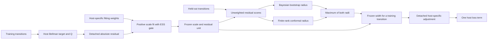

# JAX hosts and hosts + BCA: complete pseudocode

This document specifies the **current two-method implementation**: `host` and
`bca`. Each host algorithm below includes its complete update and the BCA
extension. The shared calibration procedures are defined explicitly first.
The accompanying YAML files supply dataset-specific numerical settings.

For exact implementation excerpts at every attachment point, read the
[BCA integration map](INTEGRATION.md). The README gives the short
[component responsibility map](README.md#what-owns-what-and-why).

This is an implementation specification, not a claim that these runs have
finished or that the construction has a proved policy-performance guarantee.
The historical multi-arm reproduction matrix is preserved in the
[`reproduction-matrix-v1` tag](https://github.com/dbayha7/BCA/tree/reproduction-matrix-v1).
Historical results must retain their original recipe identities.

## Contents

- [What BCA changes](#what-bca-changes)
- [The calibration pipeline](#the-calibration-pipeline)
- [Notation and state](#notation-and-state)
- [Algorithm 0: data preparation and initialization](#algorithm-0-data-preparation-and-initialization)
- [Procedure A: fitting weights and ESS gate](#procedure-a-fitting-weights-and-ess-gate)
- [Procedure B: fit the positive residual scale](#procedure-b-fit-the-positive-residual-scale)
- [Procedure C: freeze a Bayesian/conformal reference](#procedure-c-freeze-a-bayesianconformal-reference)
- [Procedure D: turn frozen width into a host adjustment](#procedure-d-turn-frozen-width-into-a-host-adjustment)
- [Algorithm 1: IQL + BCA](#algorithm-1-iql--bca)
- [Algorithm 2: TD3+BC + BCA](#algorithm-2-td3bc--bca)
- [Algorithm 3: ReBRAC + BCA](#algorithm-3-rebrac--bca)
- [Algorithm 4: CQL + BCA](#algorithm-4-cql--bca)
- [Schedules, counters, and saved evidence](#schedules-counters-and-saved-evidence)
- [What the calibration does and does not establish](#what-the-calibration-does-and-does-not-establish)

## What BCA changes

| Host | Plain host | Exact BCA intervention | Host equations reused |
|---|---|---|---|
| IQL | Capped advantage-weighted actor regression | Shrink the **excess of the capped actor weight above 1**, using frozen width | Expectile V update, twin-Q Bellman update, target Q update, actor regression loss |
| TD3+BC | Q-maximizing actor with a BC anchor | Multiply the per-transition actor BC term by a detached width-dependent factor | Both Bellman critics, target actions, delay, Q normalization, target updates |
| ReBRAC | Actor BC and critic-target BC | Multiply **actor** BC only; critic BC coefficient stays fixed | Critic BC target, twin critics, delay, Q normalization, target updates |
| CQL | SAC actor and conservative twin critics | Multiply each transition's conservative critic gap | Bellman targets, SAC actor, entropy update, target critics, unweighted Lagrange-dual gap |

`host` and `bca` use the same reserved training complement and host settings.
Thus `host` is a controlled same-pool baseline; it is not automatically a
reproduction of a published full-data score. IQL's BCA execution contains a
host actor and a BCA actor sharing **one** Q/V system. Other hosts run each
method separately.

## The calibration pipeline

This map explains responsibilities. The four algorithms below specify the
precise update order and parameter versions; this diagram does not replace them.



| Operation | Inputs → output | Purpose and code owner |
|---|---|---|
| Residual definition | Host's Bellman target and Q → absolute residual | Match the fitted quantity to that host's target. Defined by each `*_bca.py`; IQL uses [its target adapter](calibration/iql_targets.py). |
| Fitting importance weights | AWR, policy density or action affinity → tempered masses and an ESS decision | Choose how fitting examples influence the **scale loss**. [Common stabilization](calibration/weights.py), [density/affinity gate](calibration/policy_weights.py), [IQL fitting](calibration/iql_scale.py). |
| Positive scale fit | Detached residuals, fitting masses and bootstrap draw → updated scale parameters and live unit | Learn state/action variation in residual magnitude. [Scale network](calibration/network.py), [IQL scale network/loss](calibration/iql_network.py); host extensions construct the appropriate loss. |
| Radius refresh | Held-out residuals divided by the frozen scale/unit → two radii and their maximum | Set the global residual-band size for that frozen reference. [Radius math](calibration/posterior.py), [reference construction](calibration/reference.py), [IQL reference](calibration/iql_reference.py). |
| Host consumption | Frozen scale × frozen unit × radius → detached loss adjustment | Translate residual width into the specific intervention in the table above. [BC/CQL multiplier](calibration/dose.py), [IQL post-cap weights](calibration/advantage.py). |
| Execution and evidence | Config, data and event schedule → checkpoints, metrics and evaluations | Keep data, RNGs, counters and evaluation semantics reproducible. [Entry point](train.py), [config resolution](runtime/config.py), per-host `runtime` modules. |

There are three different kinds of weights: **fitting importance weights**,
**Bayesian bootstrap masses**, and **host objective weights**. They serve different
purposes and must not be interchanged. The held-out radius calculation currently
uses unweighted residual scores. The Bayesian component is a distribution over
score masses, not an additional Bayesian actor or critic model.

The live scale changes during fitting; the host consumes a **frozen** reference
between refreshes. Keeping these states separate makes the consumed width
reconstructible. Before the first usable reference, the host uses its native
weighting. Increasing a positive global radius changes width magnitude; it does
not improve the ordering of actions by width.

The exact Unifloral implementations are [bundled baseline references](baselines/README.md),
with every source file pinned in [the reference manifest](configs/unifloral.json).
These four host+BCA algorithms specify the current CORL-derived paired design.
Unifloral's different update counts, CQL ensemble and evaluation semantics are
listed in the [README](README.md#unifloral-baseline-references); they are not
silently substituted into these algorithms.

## Notation and state

| Symbol | Meaning |
|---|---|
| `Dtr`, `Dcal` | Disjoint training and held-out calibration transition blocks |
| `B={(s_i,a_i,r_i,s'_i,d_i)}` | Uniform training minibatch, sampled with replacement; ReBRAC also stores recorded `a'_i` |
| `d_i` | The converted dataset terminal indicator; retain the host's timeout convention |
| `Q_1,Q_2`, `Qbar_1,Qbar_2` | Online and target critics |
| `pi`, `pibar`, `V` | Actor, target actor where used, and IQL value network |
| `sg(x)` | Stop-gradient: treat `x` as a constant in the current objective |
| `Adam(theta,L)` | One optimizer step on `L`, including its optimizer state |
| `Polyak(target,source,tau)` | `(1-tau)*target + tau*source` |
| `eta_psi(s,a)>0` | Learned dimensionless residual-scale network |
| `u>0` | Live residual-unit exponential moving average, initialized to 1 |
| `F=(psi_f,u_f,Rconf,Rbayes,R,ready)` | Frozen scale parameters, unit and radius reference |
| `U(s,a)` | `R * u_f * max(eta_psi_f(s,a),1e-6)`; the code calls this **width** |

`U` is a **half-width**: the corresponding symmetric residual band is
`[Q-U,Q+U]`, with total length `2U`. “Full width BCA” means using the complete
Bayesian/conformal reference, not multiplying `U` by two.

All BCA fitting targets, critic predictions, fitting weights, frozen widths,
and objective multipliers are detached from the host gradients. Scale fitting
updates only `psi`; host optimization does not backpropagate through the
calibrator, radius calculation, ESS search, or fitting-weight source.

The declared defaults are `alpha_cal=0.1`, bootstrap credibility `c=0.95`,
`M=128` radius draws, soft-coverage slope `k=20`, width penalty `lambda_w=0.005`,
scale learning rate `0.001`, and scale-unit EMA coefficient `0.99`.
`alpha_cal` is distinct from TD3's Q coefficient and CQL's entropy/conservative
coefficients. Read the resolved YAML rather than relying on class defaults.

## Algorithm 0: data preparation and initialization

Source: [config resolution](runtime/config.py), [IQL preparation](calibration/iql_reference.py),
[TD3 preparation](runtime/td3_bc.py), [ReBRAC preparation](runtime/rebrac.py),
[CQL preparation](runtime/cql.py).

```text
INPUT: algorithm, dataset, method in {host,bca}, declared seed, new output directory

1. Resolve experiment.yaml + algorithm YAML + dataset overrides.
   Freeze the resolved configuration, source hashes, data hash, and event banks.
   Require a fresh output directory. Acquire the shared GPU lock if using CUDA.

2. Check the cached HDF5 file's SHA-256 before converting any data.
   Apply this host's transition conversion, including terminal/timeout filtering.
   ReBRAC: retain the recorded next action and its raw-row dependency mapping.

3. Map converted transitions to original terminal/timeout episode blocks.
   Use the documented observation-discontinuity fallback only when raw timeout
   identities are unavailable. Randomly permute whole blocks with reservation seed.
   Reserve enough whole blocks to reach the configured target number of rows.
   Reject if the actual reservation exceeds the declared maximum fraction.
   Dcal = reserved blocks; Dtr = their complement.
   Audit retained raw-row dependencies; disjoint row IDs alone do not prove
   independent trajectories or eliminate every terminal next-observation overlap.

4. Fit enabled observation statistics and enabled reward-normalization statistics
   using Dtr according to this host's preparation function.
   Apply identical transforms to Dtr, Dcal and evaluation observations as applicable.
   Simulator evaluation rewards remain raw; save raw returns and normalized scores.
   Keep host-specific reward transforms and action bounds exactly as configured.

5. Check that host and BCA use the same Dtr, normalization and host hyperparameters.
   Host: initialize host networks/optimizers only.
   BCA: initialize exactly the same host networks/optimizers, plus eta_psi and u=1.
   Set F.ready=false. No frozen BCA adjustment is active yet.
   IQL BCA: copy the initial actor and optimizer into {host_actor,bca_actor};
            share a single initialized twin-Q, target-Q and V system.

6. For BCA, declare the fixed training reference used at radius refreshes:
   IQL: up to fit_size=4096 evenly spaced Dtr indices.
   TD3/ReBRAC/CQL: the configured seeded subset of Dtr, sorted in dataset order.
   All current runs use ONE global radius group; the training reference does
   not introduce additional quantile groups or train on Dcal.

OUTPUT: prepared pools/statistics/identities, host state, optional live/frozen BCA state
```

The scale network has two hidden ReLU layers of width 64 and output
`softplus(z)+0.01`, conditioned on state and recorded action. IQL uses identity
internal state normalization after host preprocessing. TD3/CQL preserve their
internal division by `1.001` after host preprocessing. ReBRAC uses a second,
fixed calibrator normalization computed from the final training observations,
with `std+0.001`. These are implementation details, not interchangeable choices.
Scale Adam uses epsilon `1e-5` for IQL and the Optax Adam default `1e-8` for
TD3/ReBRAC/CQL. Host optimizers retain their own specified implementation.

| Host network | Declared architecture |
|---|---|
| IQL actor / each Q head / V | Two 256-unit ReLU hidden layers; configured actor dropout; twin Q |
| TD3+BC actor / each Q head | Two 256-unit ReLU hidden layers; tanh actor; twin Q |
| ReBRAC actor / each Q head | Three 256-unit ReLU hidden layers; actor LayerNorm off, critic LayerNorm on; tanh actor; twin Q |
| CQL actor / each Q head | Three 256-unit ReLU hidden layers; tanh-Gaussian actor; twin Q |

The host files own parameter initialization, including their PyTorch-style or
orthogonal initializers and optimizer conventions. The BCA extensions reuse
those initializers; they do not create replacement critics or ensembles.

## Procedure A: fitting weights and ESS gate

Source: [ESS and bootstrap product](calibration/weights.py),
[IQL AWR fitting](calibration/iql_scale.py), and the three BCA extensions.

These weights enter the **training-minibatch scale objective**. They are not
the held-out radius weights and are not asserted to be policy/behavior
importance-sampling ratios.

```text
FIT_WEIGHTS(host, minibatch B, detached host state, detached IQL advantage A, key):

1. Compute one log score ell_i per training transition:
   IQL:      ell_i = min(beta*A_i, log(100)).
             beta is the same host beta used by BOTH actors; mixing=1.
   TD3/      ell_i = -0.5 * sum_j ((a_ij - pi(s_i)_j)/h)^2.
   ReBRAC:   h = 0.15*sqrt(action_dimension) in the declared RMS-0.15 recipe.
   CQL:      ell_i = tanh-Gaussian log density at the recorded action (see below).

2. Set tau_min from the declared fitting recipe:
       IQL/CQL: 0.05; TD3/ReBRAC affinity: 0.0.
   For tau in [tau_min,1], form p_i(tau) proportional to exp(tau*(ell_i-max ell)).
   The effective sample-size fraction is ESSf(tau)=1/(|B|*sum_i p_i(tau)^2).
   If ESSf(1)>=0.25: choose tau=1.
   Otherwise, if ESSf(tau_min)>=0.25:
       bisect 32 times to retain the largest feasible tau in [tau_min,1].
   Otherwise: record ESS-infeasible at tau=tau_min; DO NOT lower the minimum.

3. Draw independent e_i ~ Exponential(1); b_i=e_i/sum_j e_j.
   Form w_i = b_i*exp(tau*(ell_i-max ell)) / sum_j same_product_j.
   Implement this product in log space; detach all resulting weights.
   Log prior ESS, fitting-score ESS, product ESS and tau separately.

4. Return w, numerical-valid flag, and ESS-feasible flag.
   The 0.25 gate applies to p(tau), NOT to the bootstrap product w.
```

CQL fitting density uses `a_clip=clip(a,-1+1e-6,1-1e-6)`, `z=atanh(a_clip)`,
and actor outputs `(mu,log_sigma)`:

```text
ell_i = sum_j [-0.5*((z_ij-mu_ij)*exp(-log_sigma_ij))^2
               - log_sigma_ij - 0.5*log(2*pi) - log(1-a_clip_ij^2)]
```

The implementation uses the actor's emitted log standard deviation here;
the **sampling** helper separately clips log standard deviation to `[-20,2]`.
Do not silently substitute one convention for the other. Log the action-clipping
fraction. The current CQL fitting convention requires action bound 1.

## Procedure B: fit the positive residual scale

Source: `fit_scale` in [TD3](algorithms/td3_bc_bca.py),
[ReBRAC](algorithms/rebrac_bca.py), [CQL](algorithms/cql_bca.py),
and `IWScaleFitter.update` in [IQL](calibration/iql_scale.py).

```text
FIT_SCALE(B, detached target y, detached prediction q, detached fitting log scores):

1. Obtain w, numerical-valid and ESS-feasible from FIT_WEIGHTS.
2. Choose the residual unit used IN THIS objective:
   TD3/ReBRAC/CQL: u_loss = live u BEFORE this update.
   IQL:           u_loss = std_B(y-q) + 1e-6.
3. eta_i = eta_psi(s_i,a_i).
   cov_i = sigmoid(k*(y_i/u_loss - q_i/u_loss + eta_i))
           * sigmoid(k*(q_i/u_loss + eta_i - y_i/u_loss)).
   cov_mean = sum_i w_i*cov_i.
   L_scale = (cov_mean-(1-alpha_cal))^2 + lambda_w*sum_i w_i*eta_i^2.
   IQL additionally adds 0.5*sum_i w_i*(cov_i-cov_mean)^2.
4. Propose psi_new and Adam state by differentiating L_scale ONLY with respect to psi.
   TD3/ReBRAC/CQL: u_new = 0.99*u + 0.01*max(std_B(y-q),1e-6).
   IQL:           u_new = 0.99*u + 0.01*u_loss.
5. Validate targets, predictions, weights, loss, gradients, proposed parameters,
   optimizer state and positive residual unit.
   If numerically valid AND ESS feasible AND supported:
       commit psi_new, Adam state and u_new; increment accepted-fit counter.
   If valid but ESS infeasible:
       preserve psi, Adam state and u; log an ESS abstention.
       Host learning can continue using the previously frozen reference.
   If numerically invalid:
       reject the invalid proposal and surface a failure; do not count it as
       ordinary ESS abstention or silently continue/retry the experiment.
6. Leave F unchanged. This live fit cannot change today's frozen decision width.
```

Fitting happens from the first update. The 10k warmup delays **consumption of
the frozen posterior**, not fitting. IQL uses its pre-V-update target and
post-Q-update online critic in this loss; the other hosts fit before their host
update. The four algorithms below make those orders explicit.

## Procedure C: freeze a Bayesian/conformal reference

Source: [reference construction](calibration/reference.py),
[radius order statistics](calibration/posterior.py),
[IQL refresh](calibration/iql_reference.py).

```text
REFRESH(host state, live psi,u, Dcal, fixed training reference, refresh key):

1. Freeze current psi and u into psi_f,u_f. These form one inseparable reference.
2. On each held-out transition compute its current host Bellman target y_j:
   IQL:      r_j + gamma*(1-d_j)*V(s'_j), using CURRENT V at refresh.
   TD3:      r_j + gamma*(1-d_j)*min_k Qbar_k(s'_j, noisy_pibar(s'_j)).
   ReBRAC:   r_j + gamma*(1-d_j)*[min_k Qbar_k(s'_j,noisy_pibar(s'_j))
                                - critic_BC*||noisy_pibar(s'_j)-a'_j||^2].
   CQL:      its configured sampled target-policy backup (Algorithm 4).
   Use the dedicated pinned refresh key for stochastic target actions.
3. q_j = min_k CURRENT online Q_k(s_j,a_j).
   sigma_j = u_f*max(eta_psi_f(s_j,a_j),1e-6).
   score_j = |y_j-q_j|/sigma_j.
   Require finite nonnegative scores and strictly positive finite scales.

4. CONFORMAL COMPONENT (unweighted held-out scores):
   Sort n scores: score_(1)<=...<=score_(n).
   k_conf = ceil((n+1)*(1-alpha_cal)), computed with decimal rank arithmetic.
   Rconf = score_(k_conf) if k_conf<=n; otherwise +infinity.
   This is equivalent to adding one equal-weight query mass at +infinity.

5. BAYESIAN-BOOTSTRAP COMPONENT:
   For m=1,...,M:
       draw e_mj ~ Exponential(1) independently over the n scores;
       normalize their masses (or use equivalent unnormalized cumulative sums);
       q_m = the smallest score whose cumulative mass reaches 1-alpha_cal.
   Rbayes = sorted(q_1,...,q_M)[ceil(M*c)] (one-based index).
   R = max(Rconf,Rbayes).

6. Validate both components and their exact max relationship.
   Commit F=(psi_f,u_f,Rconf,Rbayes,R,ready=true) only on valid input.
   Save component radii, quantile-draw identity, reference hashes and counter state.
   Preserve the live psi,u for continued minibatch fitting.
```

The held-out scores in these implementations are **unweighted**. Training AWR,
affinity or policy-density weights do not reappear in Step 4 or 5. Both radius
components remain present even when one is smaller than the other. With one
global group, the training-reference scale predictions are checked, but there
are no group boundaries to fit.

## Procedure D: turn frozen width into a host adjustment

Source: [TD3/ReBRAC/CQL multiplier](calibration/dose.py),
[IQL post-cap weighting](calibration/advantage.py).

```text
FROZEN_WIDTH(F,s,a):
    if not F.ready: return width=0, usable=true
    U = R*u_f*max(eta_psi_f(s,a),1e-6)
    require nonnegative non-NaN width and consistent positive finite scale/unit
    usable = valid AND finite(U)
    return detached U, usable

BC_OR_CQL_MULTIPLIER(F,B):
    U,usable = FROZEN_WIDTH(F,B.s,B.a)  # at RECORDED actions, not new policy actions
    if not ready: return all ones
    for each usable row: m_i = 1 + blend*U_i/(U_i+u_f)
    for each valid but unusable row: m_i = 1
    numerical invalidity is a failure, not this unsupported fallback
    return sg(m), with blend=0.5 in current YAML

IQL_ACTOR_WEIGHTS(F,B,A,beta):
    w_host_i = min(exp(beta*A_i),100)  # computed safely with a capped exponent
    if not ready: return w_host
    U,usable = FROZEN_WIDTH(F,B.s,B.a)
    if usable and A_i<=0: w_bca_i = w_host_i
    if usable and A_i>0:  w_bca_i = 1 + A_i/(A_i+U_i)*(w_host_i-1)
    if valid but unusable: w_bca_i = 0
    return sg(w_bca)
```

TD3/ReBRAC/CQL multipliers lie in `[1,1.5]`; finite positive widths give an
interior value. The frozen unit algebraically cancels in `U/(U+u_f)` but is
still needed to define the width in reward/value units. Numerically stable
rescaling is used in the code to avoid overflow.

IQL uses **post-cap shrinkage**, not `exp(beta*(A-U))`, not a lower-confidence
Bellman target, and not a gain sweep. Its positive-advantage actor weight lies
between 1 and the original capped weight. Its decision gain is fixed at 1.
An IQL actor update is skipped, including its optimizer step, when no row has
support. Otherwise the weighted actor loss is a minibatch **mean**, not a
division by the surviving weight mass.

## Algorithm 1: IQL + BCA

Host: [algorithms/iql.py](algorithms/iql.py). Extension:
[algorithms/iql_bca.py](algorithms/iql_bca.py). Configuration:
[configs/iql.yaml](configs/iql.yaml).

```text
INPUT: prepared Dtr,Dcal; N=1,000,000; host beta, expectile xi, discount gamma,
       Polyak tau, optimizer rates; Procedures A-D and declared event banks
INITIALIZE: twin Q_1,Q_2; identical target Qbar; V;
            host actor pi_H and identical BCA actor pi_B with separate optimizers;
            ONE scale fitter psi,u and ONE frozen reference F.ready=false

for t=1,...,N:
    Split the training key into next key, uniform-minibatch key and dropout key.
    B <- uniform minibatch from Dtr.

    # Shared IQL nuisance update; save pre-update quantities.
    v_next_i <- sg(V_old(s'_i))
    q_target_data_i <- sg(min_k Qbar_old_k(s_i,a_i))
    A_i <- sg(q_target_data_i - V_old(s_i))
    L_V <- mean_i [|xi - 1[A_i<0]| * (q_target_data_i-V(s_i))^2]
    V <- Adam(V,L_V)

    y_i <- sg(r_i + gamma*(1-d_i)*v_next_i)
    L_Q <- mean over rows AND both heads of (Q_k(s_i,a_i)-y_i)^2
    Q <- Adam(Q,L_Q)
    Qbar <- Polyak(Qbar,Q,tau)  # uses the just-updated online Q

    # Fit the single BCA scale; host Q/V receive no calibration gradients.
    q_fit_i <- sg(min_k Q_new_k(s_i,a_i))
    ell_i <- min(beta*A_i,log(100))
    FIT_SCALE(B,y,q_fit,ell) using IQL's current-batch unit and coverage variance term.
    Preserve the previously frozen F during both actor updates.

    # Same nuisance advantage and same beta for both actors.
    w_H <- min(exp(beta*A),100)
    w_B <- IQL_ACTOR_WEIGHTS(F,B,A,beta)
    for (pi,w) in {(pi_H,w_H),(pi_B,w_B)}:
        if configured deterministic:
            loss_i <- sum over action dimensions of (pi(s_i)-a_i)^2
        else:
            loss_i <- -sum_j log Normal(a_ij; mu_pi(s_i)_j, sigma_pi_j)
        L_actor <- mean_i sg(w_i)*loss_i
        Propose actor Adam update using the shared minibatch/dropout key.
        Commit only if numerical checks pass and at least one row is supported.
        Use the host cosine actor-learning-rate schedule over N updates;
        its optimizer counter advances only on an accepted actor step.

    Validate the nuisance, scale and actor evidence; stop on numerical failure.
    At a periodic boundary evaluate BOTH actors on the same declared reset bank.
    If t is a refresh boundary and t<N:
        REFRESH with current online Q, current V, live psi/u and held-out data;
        save the paired checkpoint/reference before the next training update.

After update N: save both actors, Q/V, target Q, optimizer and BCA states;
evaluate both actors on the separate final bank and verify actual counters.
OUTPUT: two actor trajectories, one shared Q/V trajectory, one fitted scale history
```

The stochastic IQL actor uses a tanh-bounded **Gaussian mean** with learned
state-independent standard deviation; its training likelihood is the Gaussian
at the recorded action, not a tanh-transformed action density. Deterministic
evaluation uses the mean. Dataset YAML chooses deterministic regression or
Gaussian likelihood and dropout. Both actor copies start identically.

**Plain IQL:** retain exactly the shared nuisance update above and the `pi_H`
actor update. Remove the fitter, reference refresh and `pi_B`. Keep the same
reservation and evaluation convention. The paired BCA design uses one beta
(`3` in the current configs) for both actors; historical beta-multiplier arms
are separate experiments and cannot be renamed to this pair.

## Algorithm 2: TD3+BC + BCA

Host: [algorithms/td3_bc.py](algorithms/td3_bc.py). Extension:
[algorithms/td3_bc_bca.py](algorithms/td3_bc_bca.py). Configuration:
[configs/td3_bc.yaml](configs/td3_bc.yaml).

```text
INPUT: prepared Dtr,Dcal; N=1,000,000; delay=2; host alpha_Q, gamma,tau;
       target noise std and clipping; Procedures A-D and declared event banks
INITIALIZE: deterministic pi; twin Q; target pibar,Qbar copied from online states;
            psi,u=1,F.ready=false

TD3_TARGET(B,noise_key):
    eps <- clip(Normal(0,policy_noise^2), -noise_clip,+noise_clip)
    a_next <- clip(pibar(s')+eps, -max_action,+max_action)
    return sg(r + gamma*(1-d)*min_k Qbar_k(s',a_next))

for t=1,...,N:
    Split training key; sample uniform B from Dtr; retain host update key K.
    # Uses pre-host-update networks and a separate folded noise key.
    y_fit <- TD3_TARGET(B,fold_in(K,FIT_NOISE))
    q_fit <- sg(min_k Q_old_k(s,a))
    ell <- detached affinity log scores from pi_old at the recorded actions
    FIT_SCALE(B,y_fit,q_fit,ell)
    m <- BC_OR_CQL_MULTIPLIER(F,B)  # old frozen psi_f,u_f,R

    # Unchanged host critic update; host noise is not the fitter's noise draw.
    y <- TD3_TARGET(B,K)
    L_Q <- sum_k mean_i (Q_k(s_i,a_i)-y_i)^2
    Q <- Adam(Q,L_Q)

    if t mod 2 == 0:
        q_pi_i <- Q_NEW_1(s_i,pi(s_i))
        lambda_Q <- alpha_Q / sg(mean_i |q_pi_i|)
        BC_i <- mean over action dimensions of (pi(s_i)-a_i)^2
        L_actor <- -lambda_Q*mean_i q_pi_i + mean_i sg(m_i)*BC_i
        pi <- Adam(pi,L_actor)
        pibar <- Polyak(pibar,pi_NEW,tau)
        Qbar <- Polyak(Qbar,Q_NEW,tau)
    else:
        keep actor, target actor and target critics unchanged

    Validate accepted updates and scale-fit/ESS-abstention counters.
    At refresh boundaries t<N: REFRESH using TD3_TARGET and current online Q;
                              use the declared dedicated refresh random key.
    Save scheduled checkpoints; evaluate the actor at declared boundaries.

After N: save final state; evaluate the separate final bank; verify counters.
OUTPUT: actor/Q learning histories, 1M critic steps, 500k actor steps, BCA history
```

**Plain TD3+BC:** omit `FIT_SCALE` and `REFRESH`; set `m_i=1`. The critic loss
does not use BCA weights. The width is measured at `(s_i,a_i)`, even though
the Q-maximizing part of the actor loss queries `(s_i,pi(s_i))`. The code
preserves the host's Q normalization without adding an undocumented epsilon.

## Algorithm 3: ReBRAC + BCA

Host: [algorithms/rebrac.py](algorithms/rebrac.py). Extension:
[algorithms/rebrac_bca.py](algorithms/rebrac_bca.py). Configuration:
[configs/rebrac.yaml](configs/rebrac.yaml).

```text
INPUT: prepared Dtr,Dcal with recorded next actions a'; N=1,000,000; delay=2;
       actor BC coefficient beta_A, critic BC coefficient beta_Q, gamma,tau;
       noise settings; Procedures A-D and declared event banks
INITIALIZE: deterministic pi; TWO Q heads; copied target pibar,Qbar;
            psi,u=1,F.ready=false; fixed calibrator normalization from Dtr

REBRAC_TARGET(B,noise_key):
    eps <- clip(Normal(0,policy_noise^2),-noise_clip,+noise_clip)
    a_next <- clip(pibar(s')+eps,-1,+1)
    target_BC_i <- sum_j (a_next_ij-a'_ij)^2
    q_next_i <- min_k Qbar_k(s'_i,a_next_i) - beta_Q*target_BC_i
    return sg(r_i + gamma*(1-d_i)*q_next_i)

for k=0,...,N-1:   # preserve the host's ZERO-BASED actor-update phase
    Split training key and sample uniform B from Dtr.
    y_fit <- REBRAC_TARGET(B,folded dedicated fitting-noise key)
    q_fit <- sg(min_k Q_old_k(s,a))
    ell <- detached affinity log scores from pi_old at recorded actions
    FIT_SCALE(B,y_fit,q_fit,ell)
    m <- BC_OR_CQL_MULTIPLIER(F,B)

    Split the host update key for target-action noise.
    y <- REBRAC_TARGET(B,host noise key)
    L_Q <- sum_k mean_i (Q_k(s_i,a_i)-y_i)^2
    Q <- Adam(Q,L_Q)

    if k mod 2 == 0:   # updates 1,3,5,... when numbered one-based
        pi_before <- current actor parameters
        q_pi_i <- min_k Q_NEW_k(s_i,pi(s_i))
        lambda_Q <- 1/sg(mean_i |q_pi_i|) if normalize_q else 1
        BC_i <- sum over action dimensions of (pi(s_i)-a_i)^2
        L_actor <- mean_i [beta_A*sg(m_i)*BC_i - lambda_Q*q_pi_i]
        pi <- Adam(pi,L_actor)
        pibar <- Polyak(pibar,pi_BEFORE,tau)
        Qbar <- Polyak(Qbar,Q_NEW,tau)
    else:
        keep actor and target parameters unchanged

    t <- k+1
    Validate the updates, support, multiplier and scale counters.
    At refresh boundaries t<N: REFRESH using REBRAC_TARGET and current online Q.
    Save scheduled checkpoints; evaluate the actor at declared boundaries.

After N: save final state; evaluate the separate final bank; verify counters.
OUTPUT: actor/Q learning histories, 1M critic steps, 500k actor steps, BCA history
```

**Plain ReBRAC:** omit BCA fitting/refreshes and set `m_i=1`. Both methods keep
`beta_Q` fixed in the target. Dataset-specific `beta_A` and `beta_Q` remain
distinct. ReBRAC's BC loss sums action dimensions; TD3's averages them.
The preserved ReBRAC implementation Polyak-updates its target actor from the
**pre-actor-step** parameters and its target critic from the updated critic.
Changing this timing would change the host, so it is explicit here.

## Algorithm 4: CQL + BCA

Host: [algorithms/cql.py](algorithms/cql.py). Extension:
[algorithms/cql_bca.py](algorithms/cql_bca.py). Configuration:
[configs/cql.yaml](configs/cql.yaml).

The declared configs use a tanh-Gaussian SAC actor, two critics, entropy tuning,
ten candidate actions per proposal source, importance-corrected CQL log-sum-exp,
temperature `T=1`, `bc_steps=0`, a single sampled target action and no entropy
backup. The target helper below also states the retained explicit switches.

```text
SAMPLE_PI(s,key):
    mu,log_sigma <- actor(s)
    log_sigma <- clip(log_sigma,-20,2)
    z <- mu + exp(log_sigma)*Normal(0,1)
    a <- max_action*tanh(z)
    log_pi <- sum_j [log Normal(z_j;mu_j,exp(log_sigma_j))
                     - 2*(log(2)-z_j-softplus(-2*z_j))]
    return a,log_pi   # current action bound is 1

CQL_TARGET(B,key):
    if max_target_backup:
        sample K actions at each s' with SAMPLE_PI
        choose action maximizing min_k Qbar_k(s',a) and its matching log_pi
    else:
        sample one action and log_pi at each s' with SAMPLE_PI
    q_next <- min_k Qbar_k(s',sampled_action)
    if backup_entropy: q_next <- q_next - alpha_entropy*log_pi
    return sg(r + gamma*(1-d)*q_next)

INPUT: prepared Dtr,Dcal; N=1,000,000; gamma,tau; conservative coefficient alpha_C;
       entropy target Htarget=-action_dimension; optional dual gap Gtarget;
       Procedures A-D and declared event banks
INITIALIZE: actor pi; Q_1,Q_2 and copied Qbar_1,Qbar_2;
            log entropy coefficient=0; log Lagrange coefficient=1;
            psi,u=1,F.ready=false

for t=1,...,N:
    Split key and sample uniform B from Dtr; retain host update key K.
    # Pre-host-update scale fit; separate fitting target sample.
    y_fit <- CQL_TARGET(B,fold_in(K,FIT_NOISE))
    q_fit <- sg(min(Q_1_old(s,a),Q_2_old(s,a)))
    ell <- detached recorded-action policy fitting log density (Procedure A)
    FIT_SCALE(B,y_fit,q_fit,ell)
    m <- BC_OR_CQL_MULTIPLIER(F,B)

    # All the following loss gradients use the SAME pre-update host snapshot.
    Split K into independent host policy/backup/uniform/current/next-action keys;
    retain the source's additional BC key even though bc_steps=0 here.
    a_pi,log_pi <- SAMPLE_PI(s,policy key)
    alpha_entropy <- exp(log_alpha_old)*alpha_multiplier
    L_entropy <- -mean_i log_alpha*sg(log_pi_i+Htarget)
    L_actor <- mean_i [alpha_entropy*log_pi_i - min_k Q_k_old(s_i,a_pi_i)]
    y <- CQL_TARGET(B,host backup key)

    Sample K uniform actions u_ij in [-1,1]^action_dimension at each row.
    Sample K detached actions c_ij ~ pi(.|s_i), with detached log densities lc_ij.
    Sample K detached actions n_ij ~ pi(.|s'_i), with detached log densities ln_ij.
    # All three proposal sets below are evaluated by Q at CURRENT state s_i.
    for critic h in {1,2}:
        q_data_i <- Q_h(s_i,a_i)
        Z_i <- concatenate_j(
                   Q_h(s_i,u_ij) - log((1/2)^action_dimension),
                   Q_h(s_i,n_ij) - ln_ij,
                   Q_h(s_i,c_ij) - lc_ij)
        q_lse_i <- T*logsumexp(Z_i/T)  # no division by proposal count
        gap_i <- clip(q_lse_i-q_data_i, configured_min, configured_max)
        gap_raw_h <- mean_i gap_i
        gap_bca_h <- mean_i sg(m_i)*gap_i
        L_Bellman_h <- mean_i (q_data_i-y_i)^2
        if Lagrange enabled:
            alpha_prime <- clip(exp(log_alpha_prime_old),0,1e6)
            L_cons_h <- alpha_prime*alpha_C*(gap_bca_h-Gtarget)
        else:
            L_cons_h <- alpha_C*gap_bca_h
        L_Q_h <- L_Bellman_h + L_cons_h

    if Lagrange enabled:
        L_dual <- -alpha_prime*alpha_C*((gap_raw_1+gap_raw_2)/2-Gtarget)
        # Uses UNWEIGHTED gaps; Gtarget is NOT multiplied by m.

    Apply actor, both critic, log-entropy and enabled dual Adam updates,
    using gradients computed from the pre-update snapshot above.
    Disabled scalar branches retain the host's zero-gradient bookkeeping.
    On the configured target period:
        Qbar_h <- Polyak(Qbar_h,Q_h_NEW,tau), for h=1,2

    Validate scale, width and host proposals; preserve/flag invalid attempts.
    At refresh boundaries t<N: REFRESH using CQL_TARGET and current online twins.
    Save scheduled checkpoints; evaluate with deterministic tanh(mean), not samples.

After N: save final state; evaluate separate final bank; verify actual counters.
OUTPUT: actor/Q/entropy/conservative histories, 1M updates per actor/critic, BCA history
```

**Plain CQL:** omit scale fitting and refreshes; use `gap_raw_h` wherever
`gap_bca_h` appears. The host's `cql_importance_sample` correction inside
`logsumexp` is separate from BCA's training-scale fitting weights. BCA does
not multiply the Bellman loss, the SAC actor loss or the Lagrange target gap.
When Lagrange is disabled, its reported zero `alpha_prime` is an unused
placeholder; the configured fixed conservative coefficient remains active.

## Schedules, counters, and saved evidence

Source: [experiment schedule](configs/experiment.yaml),
[training entry point](train.py), and the host-specific `runtime` modules.

| Item | IQL pair | TD3+BC / ReBRAC / CQL |
|---|---|---|
| Training budget | 1M shared Q/V updates; 1M attempted steps per actor | 1M host/critic updates |
| Actor steps | Host: 1M; BCA: measured accepted count with abstentions | TD3/ReBRAC: 500k; CQL: 1M |
| Scale fitting | Attempt every host update; save accepted and ESS-abstained counts | Same |
| First frozen reference | After update 10,000; used starting at 10,001 | Same |
| Refreshes | 10k,15k,...,995k: 198 total | Same |
| Periodic evaluation | Every 5k: 200 banks, **2 episodes per actor** | Every 5k: 200 banks, **10 episodes** |
| Final evaluation | Separate 20-episode bank per actor | Separate 20-episode bank |
| Checkpoints | Each frozen reference and training end | 10k,50k,1M |
| Evaluation actions | Deterministic actor/mean | Deterministic actor; CQL tanh(mean) |

IQL preserves its paired two-episode periodic protocol; it is not silently
described as a ten-episode protocol. Both paired actors use identical evaluation
IDs and reset seeds. IQL evaluates a boundary before the next refresh;
the other runners refresh, checkpoint and then evaluate at that boundary.
Refresh itself does not update actor parameters.

All PRNG keys are split/folded as implemented, with separate fitting, bootstrap,
refresh and evaluation streams. Evaluation does not advance the training RNG.
TD3 and ReBRAC use different actor-delay phases, as specified above. Do not
average their logged zero placeholders for skipped actor steps into an
“actor-update mean.”

Every accepted run saves the resolved configuration, source/data identities,
training/held-out/reference identities, preprocessing metadata, event records,
network/optimizer checkpoints, evaluations and failure/completion receipts.
Completion requires matching actual optimizer counters, scheduled banks and
checkpoint identities. A retained loss value alone does not prove its optimizer
step was accepted. An interrupted or failed attempt is preserved rather than
replaced by a silent retry.

## What the calibration does and does not establish

The score being calibrated is an **absolute one-step Bellman residual**,
normalized by a learned positive scale and a residual unit. The bootstrap is
over calibration-score masses; it is not a Bayesian posterior over the host
actor, critic parameters or environment dynamics. Training-scale reweighting
and held-out radius construction are different operations with different
measures.

The code implements a split-conformal-style finite-rank component and a
Bayesian-bootstrap quantile component, combined by their maximum. Repeated
reuse of the held-out bank influences later policies and critics through BCA;
offline trajectory dependence and evolving Bellman targets also matter.
Therefore the rank formula by itself does not establish independent-score
exchangeability, conditional action-wise coverage, off-policy return coverage,
or a policy-safety theorem for the full adaptive training loop.

A positive global radius can rescale widths but cannot repair their ordering
across actions. Good residual coverage, accepted scale fits, or a larger
conservative multiplier do not prove useful behavioral-harm ranking or better
whole-policy performance. Those require their own held-out measurements and
comparisons, with original failures and evaluation semantics retained.

For reproducibility, the source-linked equations above describe the current
implementation. Changes motivated by additional papers should be declared and
tested as new scientific changes; they must not be silently folded into an
organizational refactor or assigned to old results.
