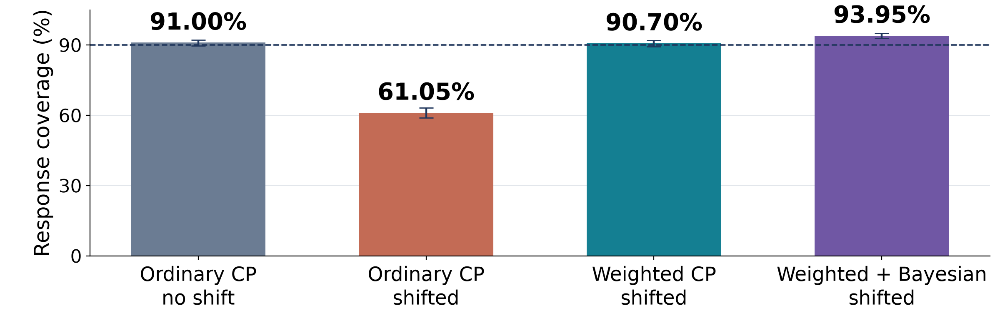
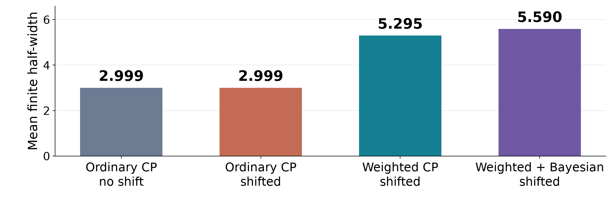

# BCA results, interpretation and the weighted-conformal next step

Evidence snapshot: September 29, 2026, approximately 9 a.m. EDT. This is a result analysis, not a new status poll or scientific run. Original TD3+BC Hopper pilot, reviewed TD3/ReBRAC Walker training, preliminary CQL Walker diagnostics, and controlled synthetic results remain separate.

**Research objective:** Determine whether BCA provides calibrated and decision-useful uncertainty for actions that differ from the calibration population. The next hypothesis is whether target/source weighting of the conformal threshold improves response coverage under a declared shift, and whether that improvement helps action decisions.

**Advisor transition:** BCA is fitting and changing penalties, but the pilot has weak overall harm ordering and no average tested-action regret improvement. Fresh coverage under shift remains unverified. The code audit independently shows that old fitting-IW recipes omitted the intended weighted conformal threshold. We should correct and test that specific mechanism, while keeping scale fitting and host losses fixed initially. This does not assume that weighting will solve every observed limitation.

## Research objective and the next hypothesis

Goal: useful error bands for actions that differ from the calibration population.

| Question | What this study measures | Why it matters |
| --- | --- | --- |
| Does BCA operate? | Scale fitting, radius refreshes and consumed multipliers | Separates execution failures from a weak uncertainty signal. |
| Are bands calibrated? | Fresh response coverage under a declared action shift | Tests whether the stated 90% target still holds. |
| Do warnings identify harm? | Within-state AUROC and AP against simulator outcomes | Tests usefulness for choosing among actions at one state. |
| Do choices improve? | Regret among tested actions under a fixed later policy | Connects warnings to local decision quality. |
| What should IW change? | Weight calibration errors for the target population | Tests a specific mismatch that ordinary CP leaves open. |

The research objective is to determine whether BCA supplies calibrated and decision-useful uncertainty for actions that differ from those represented in its calibration data. These are separate questions: operational fitting, response coverage, harm ranking, and decisions. The current standard-BCA study supplies an equal-fitting-weight baseline. The old IW recipes changed the scale-fitting objective but did not fully implement the intended target/source weighted conformal threshold. This motivates an explicit correction and a controlled comparison. Weak pilot harm ranking does not itself prove covariate shift caused a coverage failure. The planned weighted-CP stage must measure that mechanism directly, then ask whether improved coverage helps decisions. All empirical examples in this deck retain their host, dataset and training-seed identities.

Sources: outputs/advisor_metrics/2026-09-29/METRICS_OVERVIEW.md; docs/WEIGHTED_CONFORMAL_DESIGN.md.

## Harm ranking has signal, but limited separation

Original TD3+BC Hopper pilot. Frozen BCA continuation. One seed and dependent reset blocks.

| Result and its purpose | Meaning and impact | Improvement to test |
| --- | --- | --- |
| AUROC 0.529 Checks harm ordering. | Close to the 0.500 tie baseline. Distance reaches 0.566. | Repeat across seeds and preserved state groups. |
| AP 0.510 Checks top warnings. | Above constant AP 0.275. Distance is higher at 0.542. | Check whether enrichment persists on new panels. |
| 111/256 eligible panels Shows metric support. | 145 panels have one class. Their AUROC/AP remain N/A. | Report valid counts and uncertainty by reset block. |
| Pooled width AUROC 0.432 Checks across-state mixing. | A different question from choosing actions at one state. | Keep within-state ranking as the primary comparison. |
| Implication for IW | Useful warnings are incomplete. The cause is still unresolved. | Measure shifted coverage before attributing this to CP. |

Why AUROC matters: a useful warning should rank a harmful alternative above a harmless alternative at the same captured state. Equal-stratum within-state width AUROC is 0.529327, compared with support distance 0.565805, fixed random 0.513251 and constant 0.5. That is weak descriptive separation, not a statistically established failure across seeds. Why AP matters: when warnings are ranked from largest to smallest, AP summarizes enrichment of harmful actions. Width AP 0.510392 exceeds constant 0.274558 but falls below distance 0.542025. Thus the pilot contains some signal; calling it completely uninformative would be wrong. AP uses eligible panels and equal stratum weights, so the constant baseline differs from the pooled 11.98% harm frequency. Why eligible counts matter: 111 of 256 panels contain both classes; the remaining 145 cannot identify binary ranking. Pooled AUROC 0.431776 mixes states and is not a replacement for the primary action-ranking quantity. Expected useful behavior is repeatable within-state ranking and top-warning enrichment, accompanied by uncertainty intervals that respect reset-block dependence. Next: complete the declared seeds, preserve all strata, and measure fresh shifted residual coverage. Weighted CP could address population mismatch in coverage, but the pilot does not identify that mismatch as the cause of weak ranking.

Sources: outputs/ood/td3_bc/hopper/s202609171/real-harm-report-v1/summary.json; outputs/advisor_metrics/2026-09-29/METRIC_EVIDENCE.json.

## Distance identifies a harder group, not every bad move

Support means distance to recorded actions near the state. It is a proxy, not exact OOD status.

| Result and its purpose | Meaning and impact | Improvement to test |
| --- | --- | --- |
| Near: 231/2,071 harmful 11.15% of alternatives | Familiar-looking actions can still have poor outcomes. | Keep a near-action control when testing OOD behavior. |
| Distant: 45/233 harmful 19.31% of alternatives | Higher descriptive harm rate. Group sizes are unequal. | Use declared support bands with comparable sampling. |
| 231/276 harmful are near Checks missed harmful actions. | A distance-only warning would miss much of the observed harm. | Evaluate error bands against outcomes within each band. |
| 188/233 distant are harmless Checks unnecessary caution. | Penalizing all distant actions could discard useful actions. | Track lost good actions alongside detected harm. |
| Implication for IW | Distance alone does not supply a target/source probability ratio. | Define source and target laws before constructing weights. |

These counts concern nine alternatives per captured row under the frozen BCA continuation, with harmful defined as loss greater than 1 raw reward unit against the host first action. The 2,304 alternatives contain 276 harmful outcomes. Near actions have 231/2,071 harm, or 11.153%; distant actions have 45/233, or 19.313%. The difference makes support shift a useful study dimension but cannot establish causation or a repeated seed-level effect. Most harmful alternatives are near because that group is much larger, and 188 of 233 distant alternatives are not harmful. These two facts guard against interpreting all OOD actions as bad. The support measure is minimum RMS action distance to recorded actions among 32 nearby reference states, with the frozen threshold 0.21134613219046514. It is neither true behavior density nor a calibrated density ratio. Improvement: balanced, predeclared support strata and matched same-state interventions can locate where warning quality changes. For weighted CP, use a justified population ratio; do not insert this distance as though it were Q_X/P_X. No new support threshold or penalty is tuned from these outcomes.

Sources: outputs/ood/td3_bc/hopper/s202609171/real-harm-report-v1/summary.json; outputs/advisor_metrics/2026-09-29/METRIC_EVIDENCE.json.

## Warning quality depends on the state group

Width AUROC within each stratum. No stratum is omitted because it looks unfavorable.

| Result and its purpose | Meaning and impact | Improvement to test |
| --- | --- | --- |
| Host reset: 0.449 23 eligible panels | Below the tie baseline in this captured group. | Repeat this group with new seeds and reset blocks. |
| Host step 100: 0.640 34 eligible panels | The most favorable group in this pilot. | Check whether the advantage survives new data. |
| BCA reset: 0.557 25 eligible panels | Modest separation here. Same initial reset population. | Preserve shared-reset pairing in uncertainty. |
| BCA step 100: 0.471 29 eligible panels | Later BCA states do not show the same favorable ordering. | Separate state-visitation shift from action shift. |
| Widths 1.35–2.48 No all-action ties | Changing width alone does not establish useful ranking. | Test scale quality and query-specific CP separately. |

All four groups contain 64 captured rows. Exact width AUROCs are 0.448775 at host reset, 0.640231 at host step 100, approximately 0.557 at BCA reset and approximately 0.471 at BCA step 100; the preceding result slide retains exact rounded values drawn from the same JSON. Support AUROCs are approximately 0.501, 0.652, 0.588 and 0.522, respectively. The favorable host-step-100 subgroup cannot justify a broad OOD claim. Eligibility differs across groups, and reset origins create dependence. The two reset groups use a common initial reset population, so their differences should not be explained as an isolated state-visitation effect without checking the panel construction. Widths range from 1.352397 to 2.478726, with median 1.746680 and no panel tying all alternative widths. This rules out a trivial all-tied explanation for the entire pilot. A positive global radius multiplies all action widths at a state and cannot change their order. A properly query-dependent conformal radius may change ordering, but weighted CP promises a coverage property under assumptions, not better harm ranking. Improvements should distinguish scale-model ordering, action-shift weighting and state-visitation shift rather than changing all three simultaneously.

Sources: outputs/ood/td3_bc/hopper/s202609171/real-harm-report-v1/summary.json; outputs/advisor_metrics/2026-09-29/METRIC_EVIDENCE.json.

## Better average action choice remains unestablished

Exploratory regret against the best of ten tested actions. Lower is better.

| Result and its purpose | Meaning and impact | Improvement to test |
| --- | --- | --- |
| BCA later policy Host 6.333, BCA 6.453 | BCA first action has 0.120 more average tested regret. | Repeat paired first-action comparisons across seeds. |
| Host later policy Host 8.242, BCA 8.490 | BCA first action has 0.248 more average tested regret. | Retain both continuations to expose policy dependence. |
| Why regret matters | Measures missed opportunity within the tested action set. | Report the candidate set and paired uncertainty. |
| Expectation versus evidence | Expected lower regret with better uncertainty-guided choices. | Check warning quality and how each host uses the band. |
| Implication for weighted CP | Coverage can improve without improving the selected action. | Require separate evidence for decision benefit. |

Regret here is max_a G(s,a; fixed continuation) minus G for the selected first action, restricted to ten tested actions. It is not regret against the unknown globally optimal action or policy. Under BCA continuation, host-first regret is 6.333291 and BCA-first regret 6.452882, a difference of 0.119590. Under host continuation they are 8.242197 and 8.489876, a difference of 0.247679. These are descriptive, exploratory means in one training seed, with correlated states/actions and no new significance claim. Both directions fail to establish the hoped-for mean reduction. They do not identify whether the cause is the scale model, the radius, the host attachment, learned policy differences or the candidate panel. The useful next step is paired replication under the frozen protocol, followed by a separated test of coverage correction and host consumption if warranted. A weighted-CP band can attain better target coverage while still ranking harm poorly or encouraging excessive conservatism. We will therefore keep regret alongside coverage, AUROC/AP, lost good actions and return.

Sources: outputs/ood/td3_bc/hopper/s202609171/real-harm-report-v1/summary.json; outputs/advisor_metrics/2026-09-29/METRIC_EVIDENCE.json.

## BCA is active, but activity does not prove usefulness

Reviewed TD3+BC and ReBRAC Walker runs. Seed 202609171. Last 1,000-update block where stated.

| Result and its purpose | Meaning and impact | Improvement to test |
| --- | --- | --- |
| 1,000,000 accepted fits each Checks calibrator execution. | Both scale learners updated. Inactivity is not the explanation. | Measure fresh residual coverage and warning quality. |
| Scale objectives 0.01093 / 0.01000 | These are fitting diagnostics. Small values do not certify Q. | Test fixed-target errors on an independent bank. |
| Actor BC dose 1.331 / 1.377 | BCA increases imitation strength by about 33% / 38%. | Compare a declared matched fixed-strength control later. |
| Why dose matters | A useful band still needs an effective host intervention. | Keep host attachment fixed for the first CP comparison. |
| Implication for IW | Fit weights change the scale. CP weights change the threshold. | Test the weighted threshold before combining both changes. |

The checkpoint counters independently establish one million accepted scale fits in each reviewed Walker run, with one million critic/host updates and 500,000 delayed actor updates. This rules out complete fit abstention for these two examples, not for every host or historic recipe. The final block scale-fitting objectives are TD3 0.0109333582 and ReBRAC 0.0100045581. Their magnitudes do not establish true-Q accuracy, calibration validity or useful risk ordering. Final block actor BC multipliers are 1.331356 and 1.377448: about 33.14% and 37.74% greater imitation coefficients than the same host coefficient before multiplication. These are mean multipliers, not the fraction of actions copied, a coverage level, or percentages of reliance on the old policy. They also do not measure gradient norms. A matched fixed-strength control is a future separately declared comparison, not an already measured explanation or permission to choose a winning constant. The immediate weighted-CP comparison should hold the scale-fitting rule and host attachment fixed, so any coverage change can be attributed to threshold weighting. Fitting IW can be evaluated in a later factorial comparison.

Sources: outputs/advisor_metrics/2026-09-29/METRIC_EVIDENCE.json; outputs/standard_bca/*/walker2d/*/s202609171/verified-v1/; analysis/current_results_20260929/inputs/cluster_snapshot.json.gz.

## The Bayesian radius controls these observed bands

198 logged refreshes in each reviewed Walker run. Both radius components remain present.

| Result and its purpose | Meaning and impact | Improvement to test |
| --- | --- | --- |
| 198 refreshes each Checks radius updates. | Both components refresh through the declared schedule. | Verify freshness, snapshots and checkpoint reconstruction. |
| Conformal below Bayesian 198/198 in both runs | The maximum selects Bayesian at every logged refresh here. | Measure each radius and fresh coverage separately. |
| Why this matters for IW | A corrected CP radius may still lie below the Bayesian radius. | Check whether the correction changes the consumed band. |
| Larger global radius | Widens every band without changing action order. | Separate coverage correction from scale/harm alignment. |
| Expected useful outcome | Adequate coverage with informative finite widths. | Report width and infinity rate alongside coverage. |

The effective radius is max(Bayesian, conformal). In both reviewed TD3 and ReBRAC Walker training histories, the conformal floor is lower at all 198 logged refreshes. This establishes which component sets the observed scalar maximum, but does not justify removing the floor. A larger band can cover more responses while being less informative, so both coverage and width are necessary. This result is especially relevant to weighted CP: correcting an inactive conformal floor may leave the final max unchanged. We must inspect conformal-only and full-band diagnostics, and separately specify whether the Bayesian observed-score masses also use valid target weights. Otherwise a null decision change could simply mean the corrected component never affects the consumed band. Positive global scaling cannot repair within-state action ordering. Query-specific conformal radii can vary with the query ratio, but improved ranking remains an empirical question. The Bayesian observed-support bootstrap remains an additional construction; taking a maximum does not validate a finite-draw 95%-confidence population-risk theorem. Keep both components while testing their distinct contributions.

Sources: outputs/advisor_metrics/2026-09-29/METRIC_EVIDENCE.json; outputs/standard_bca/*/walker2d/*/s202609171/verified-v1/; analysis/current_results_20260929/inputs/cluster_snapshot.json.gz.

## TD3 estimates fall while its fitting loss rises

Walker, seed 202609171. Final 1,000-update blocks. Host and BCA learn different moving targets.

| Result and its purpose | Meaning and impact | Improvement to test |
| --- | --- | --- |
| Q1: 207.10 to 191.92 Tracks value predictions. | BCA predicts lower values at proposed actor actions. | Compare against independent value probes at fixed inputs. |
| Loss: 55.42 to 61.31 Tracks critic fitting. | BCA has higher loss against its current training targets. | Use a shared frozen target and held-out transitions. |
| Why both matter | Lower Q could reduce optimism or suppress good actions. | Measure prediction error and action harm separately. |
| Expectation versus evidence | More caution appears in Q. More accurate Q is unverified. | Avoid interpreting lower Q as successful correction. |
| Implication for IW | Threshold weighting targets response coverage under shift. | It does not make these training targets ground truth. |

TD3 Walker final block Q1 at proposed actor actions changes from host 207.100791 to BCA 191.923997. The critic fitting objective changes from 55.421106 to 61.308944. Both observations are worth showing because return alone cannot reveal whether the critic values or learning signal changed. However, the policies and targets also change during training, so these logs do not compare two predictors against the same truth. Lower Q might reflect reduced overestimation, excessive pessimism or simply different actions/states evaluated by the logging path. Higher fitting loss is not a measurement of OOD harm or a proof of worse true values. Next: compare frozen predictors at common inputs against an explicitly defined fixed response, and use independent simulator outcomes for action quality. The weighted-CP response is the declared frozen one-step Bellman target; its coverage is not true long-horizon Q coverage. The first radius experiment should keep this response definition unchanged to isolate the distribution correction.

Sources: outputs/advisor_metrics/2026-09-29/METRIC_EVIDENCE.json; outputs/standard_bca/*/walker2d/*/s202609171/verified-v1/; analysis/current_results_20260929/inputs/cluster_snapshot.json.gz.

## ReBRAC shows the same unresolved value tradeoff

Walker, seed 202609171. Q is the twin minimum on recorded actions, unlike the TD3 logger.

| Result and its purpose | Meaning and impact | Improvement to test |
| --- | --- | --- |
| Qmin: 232.63 to 216.31 Tracks recorded-action values. | BCA has lower logged Q at dataset actions. | Check shared inputs and independent value evidence. |
| Loss: 20.30 to 24.75 Tracks critic fitting. | Higher loss accompanies the lower value predictions. | Measure frozen-target error on untouched transitions. |
| Why the query point matters | Recorded-action Q differs from TD3 proposed-action Q. | Do not rank host optimism using these two log scales. |
| Expectation versus evidence | The logs show a changed learner. Accuracy remains unresolved. | Connect each diagnostic to the same host's OOD panel. |
| Implication for IW | Preserve ReBRAC's target and critic BC in the first correction. | Change only the declared calibration calculation. |

ReBRAC Walker final block twin-minimum Q at recorded dataset actions falls from 232.634650 to 216.314605, while critic loss rises from 20.296611 to 24.752905. These are the same qualitative directions as TD3 but use a different query point and logging order; cross-host Q magnitudes cannot rank relative optimism. ReBRAC's actor BC multiplier changes while its critic BC remains part of the original host. A weighted-CP experiment must preserve the host's regularized target definition and critic BC to avoid a confounded comparison. Fixed-target residual tests can assess fitting at a common response. Separate OOD interventions assess whether candidate actions actually cause harm. Neither a training-loss increase nor lower Q by itself establishes why BCA performance is weak. The proposed improvement is better isolation and measurement, followed by a specific weighted-threshold intervention if the population contract is satisfied.

Sources: outputs/advisor_metrics/2026-09-29/METRIC_EVIDENCE.json; outputs/standard_bca/*/walker2d/*/s202609171/verified-v1/; analysis/current_results_20260929/inputs/cluster_snapshot.json.gz.

## CQL changes its critic, but the mechanism is unverified

Preliminary CQL Walker seed 202609171. Final sparse snapshot, not a full-block average.

| Result and its purpose | Meaning and impact | Improvement to test |
| --- | --- | --- |
| Q1: 177.15 to 163.12 Tracks recorded-action values. | BCA's logged values are lower. Accuracy remains unknown. | Use fixed inputs and independent value probes. |
| Bellman loss: 35.60 to 37.20 Tracks target fitting. | The final sampled loss is higher. Targets change during learning. | Compare frozen responses and review checkpoint counters. |
| CQL objective: 13.68 to 13.21 Tracks conservative training. | The scalar objective changes. It is not a gradient norm. | Measure the consumed loss contribution at fixed inputs. |
| Gap multiplier: 1.345 Checks BCA's intervention. | One recorded-action band scales the transition's CQL gap. | Audit input alignment before query-dependent integration. |
| 198 refreshes Sparse fitting evidence | Historical numerical radii are absent from this export. | Retain missing values and finish independent review. |

CQL Walker final sparse snapshot values are host/BCA Q1 177.151443/163.115646, Q1 fitting loss 35.597420/37.195969, and conservative objective 13.682011/13.208880. The BCA critic-dose mean is 1.345180 and scale objective 0.011620161, with this sampled row accepting a fit. These are one of 1,000 sparse retained last rows, not means over all updates. They cannot independently prove one million accepted scale fits. There are 198 successful refresh records, but historical numerical radii are absent from this extracted record, and the full independent checkpoint review remains pending. Why these metrics matter: they show that the intervention reaches the critic, but neither scalar loss magnitude nor lower Q identifies a gradient mechanism or true-value improvement. Current CQL attaches a detached recorded-transition multiplier to the conservative gap. It does not assign a distinct calibrated interval to every sampled negative action in that gap. The first weighted-CP implementation must make the actual query point explicit while preserving the original dual-gap definition. Candidate-specific penalties would be a separate host-method change. Improvement begins with schema/counter review and frozen-input diagnostic comparisons, not silently relabeling the existing treatment.

Sources: outputs/advisor_metrics/2026-09-29/METRIC_EVIDENCE.json; outputs/standard_bca/*/walker2d/*/s202609171/verified-v1/; analysis/current_results_20260929/inputs/cluster_snapshot.json.gz.

## Why these results lead to weighted conformal prediction

Working hypothesis: calibration-population mismatch may contribute. The current pilot does not establish that cause.

| What we have learned | Question it raises | Next test and rationale |
| --- | --- | --- |
| Scale fits and dose are active. | Are the resulting bands valid for the actions we test? | Measure fresh coverage on a declared target population. |
| Harm ranking is weak overall. | Does useful calibration degrade as the action population shifts? | Compare coverage and harm within fixed support bands. |
| Ordinary CP uses source errors. | Do those errors represent target queries adequately? | Weight errors by a justified target/source probability ratio. |
| Old IW changes scale fitting. | Does threshold weighting fix the missing population correction? | Hold fitting fixed and compare ordinary versus weighted CP. |
| Regret has not improved. | Would better coverage produce better decisions for this host? | Require separate gains in ranking or regret to claim help. |

Suggested advisor wording: Standard BCA is operational, but the pilot does not yet show strong harm ordering or reduced tested-action regret. That motivates asking whether the calibration errors represent the action population on which we use the bands. Weighted conformal prediction supplies a principled way to adjust a conformal threshold for a declared population shift when its assumptions hold. We will first test that coverage mechanism with the scale predictor and host definition held fixed, then examine whether any coverage improvement helps action ranking or regret. The current data motivate the question, not its answer. Weak AUROC does not establish a coverage violation; no verified fresh OOD residual-coverage measurement is yet available. The code audit provides independent motivation: older fitting-IW variants never connected target/source ratios and query mass to the conformal threshold. Correcting that implementation gap is necessary to test the intended method, even if it ultimately does not improve behavior. Both negative and positive results are informative because they distinguish calibration validity from decision usefulness.

Sources: outputs/advisor_metrics/2026-09-29/METRICS_OVERVIEW.md; docs/WEIGHTED_CONFORMAL_DESIGN.md.

## Current IW fitting leaves the weighted-CP step incomplete

Code audit: calibration/reference.py and calibration/posterior.py. The lower-level routine already accepts masses.

| Component | What the current host path does | What weighted CP requires |
| --- | --- | --- |
| Scale fitting | Old IW reweights the loss that trains the error scale. | Keep this separate from calibration-threshold weights. |
| Calibration errors | One group supplies equal masses to the radius refresh. | Target/source mass for each held-out error. |
| Query correction | The host path supplies query mass 1 and caches one radius. | The actual query ratio and its finite-sample correction. |
| Weight meaning | Policy density, affinity or advantage are fitting heuristics. | A declared population ratio with justified support. |
| Independence and output | Calibration feeds later learning. The active cache is scalar. | Fresh frozen-score validation, query-aware cache and infinity. |

This is an implementation gap relative to the intended weighted-conformal method, not a claim that standard equal-weight BCA secretly contains a failed importance-weighting treatment. The clean repository's four host paths refresh through fit_posterior with one group. partitioned_posterior uses a group indicator as calibration mass and query mass one. Therefore enabling fitting IW does not turn the conformal threshold into target/source weighted CP. posterior_radius has lower-level unequal-mass support, but the host path does not supply the needed ratios. A query-dependent conformal threshold also cannot generally be represented by the single cached scalar currently used. CQL policy density alone lacks the behavior-density denominator; TD3/ReBRAC affinity and IQL advantage weights are not automatically density ratios. The calibration bank influences later actor/critic updates, so freezing the final model does not undo this dependence. The first valid empirical test requires a fresh calibration/test design after freezing the score construction, or a separately justified adaptive method. Source: docs/WEIGHTED_CONFORMAL_DESIGN.md and calibration/reference.py; calibration/posterior.py.

Sources: docs/WEIGHTED_CONFORMAL_DESIGN.md; calibration/reference.py; calibration/posterior.py; experiments/weighted_conformal/reference.py.

## Weighted CP changes how errors set the band

Alpha remains 0.1. The response is a frozen Bellman target, not known true Q or a safety label.

| Step | Calculation | Purpose |
| --- | --- | --- |
| Freeze the score | S = abs(Y − m(X)) / sigma(X) X = (state, action) | Compare target errors on a common positive scale. |
| Weight calibration errors | w(X) = target density / source density | Give more mass to errors more relevant to target queries. |
| Include the query | Threshold = 0.9 × (sum of bank weights + w(query)) | Account for the unseen query in finite samples. |
| Find the conformal radius | First sorted error reaching the cumulative mass threshold | If no error reaches it, the radius is infinity. |
| Retain both components | R = max(R_CP(query), R_Bayes) Half-width = sigma(query) × R | Keep the conformal floor and Bayesian component visible. |

The additive reference uses frozen X=(s,a), center m(X), positive scale sigma(X), and a specified frozen one-step Bellman response Y using observed reward/next state/terminal flag and fixed target-randomness law. Score S_i=|Y_i-m(X_i)|/sigma(X_i). With w(x)=dQ_X/dP_X(x), use calibration masses w(X_i) and query mass w(x), normalized by their combined total. The conformal radius is the 1-alpha quantile of the observed-score masses plus the query's mass at positive infinity. Common positive rescaling of all weights cancels; separately normalizing query and bank weights is wrong. As a toy arithmetic example only, scores [1,2,3,4], masses [1,1,1,7], query mass 1 and alpha .4 produce cutoff .6*11=6.6, so radius 4. Equal masses instead produce radius 3. Query mass 100 produces cutoff 66 above observed mass 10, so radius infinity. This toy alpha does not change the study alpha .1. A full radius 4 with scale 2 and center 10 yields half-width 8 and interval [2,18]. Source for the conformal correction: Tibshirani et al. (2019), https://www.stat.berkeley.edu/~ryantibs/papers/weightedcp.pdf, equations (5)-(7), Corollary 1 and split-conformal discussion. Bayesian masses and credibility calculation remain a separately labeled construction; the maximum cannot narrow a conformal band, but it supplies no automatic Bayesian population-risk guarantee.

Sources: docs/WEIGHTED_CONFORMAL_DESIGN.md; calibration/reference.py; calibration/posterior.py; experiments/weighted_conformal/reference.py.

## A valid ratio needs a defined population

Estimated ratios are an additional approximation. The intended guarantee is marginal response coverage.

| Requirement | Why it matters here | Implementation decision |
| --- | --- | --- |
| Source and target populations | Action shift and changed state visitation need different ratios. | Declare both sampling laws before measuring outcomes. |
| Support overlap | A point-mass actor lacks a ratio to continuous actions. | Use a justified supported target. Label any neighborhood explicitly. |
| Same response law given X | Changing target construction changes the quantity covered. | Freeze critic, target, scale and target-action randomness. |
| Fresh calibration and testing | Training-bank feedback breaks a simple independent-score claim. | Reserve untouched samples and account for trajectories. |
| Honest extreme-weight handling | Clipping or tempering changes the ratio or target population. | Log weight concentration and preserve infinite bands. |

Weighted CP requires more than plugging arbitrary weights into a quantile. We must name the source and target distributions, ensure target support is contained in source support, retain the same conditional response distribution, and justify the calibration/query sampling contract. A policy-action ratio only handles action shift under a justified common state population; changed state visitation requires its state component as well. Deterministic TD3/ReBRAC query actions can be singular relative to continuous source actions. Smoothing an estimated behavior density does not solve that measure mismatch. A declared stochastic neighborhood is a different target and cannot be quietly called deterministic-policy coverage. For an estimated-ratio stage, fit source-versus-target classification on separate covariates, correct class-prior odds, freeze the estimator, and assess overlap/weight concentration. Do not choose ratios using harm labels. Clipping or ESS tempering cannot silently enter the conformal floor as though the original ratio theorem survived unchanged. Freezing after adaptive bank reuse does not restore independence, and episode separation alone does not make within-trajectory transitions IID. Infinite intervals must remain infinite in coverage reports; a policy fallback when an interval is unbounded is a separate engineering and behavioral decision. These are gates for the next experiment, not excuses to relabel the old data.

Sources: docs/WEIGHTED_CONFORMAL_DESIGN.md; calibration/reference.py; calibration/posterior.py; experiments/weighted_conformal/reference.py.

## A controlled shift validates the correction mechanism

CPU synthetic test only. 2,000 independent trials, 199 calibration rows per trial, target coverage 90%.

| Setting and observed coverage | Why this result matters | Meaning and next step |
| --- | --- | --- |
| Ordinary CP on source 91.00% coverage | The source-population control is near the nominal target. | Establishes the starting point for this constructed example. |
| Ordinary CP after shift 61.05% coverage | Changing population alone can undermine source calibration. | Demonstrates the hypothesized failure in a controlled setting. |
| Weighted CP after shift 90.70% coverage | Known correct ratios recover approximately nominal coverage. | Validates threshold arithmetic. Real RL ratios remain a gate. |
| Weighted + Bayesian maximum 93.95% coverage | The retained maximum gives wider bands and extra coverage. | Compare informativeness too. Mean radius 5.590 vs 5.295. |
| 15 reference checks pass 0 infinite bands in these trials | Separate tests require infinity and verify that it stays intact. | Integrate query-aware radii before claiming a host result. |

The synthetic source contains 20% high-error and 80% low-error examples; the target contains 80% high-error and 20% low-error examples. Conditional responses remain Uniform(0,1) for easy examples and Uniform(0,6) for hard examples, with fixed center zero and scale one. Correct target/source ratios are .25 and 4. Ordinary source coverage is 91.00%, 95% interval 89.66–92.22%, with mean finite radius 2.999. Under the target shift ordinary coverage is 61.05%, interval 58.87–63.19%, same radius. Weighted CP gives 90.70%, interval 89.34–91.94%, radius 5.295. The weighted-plus-Bayesian maximum gives 93.95%, interval 92.81–94.95%, radius 5.590. This is the strongest existing direct evidence for the proposed coverage mechanism because the shift and ratios are known by construction. It does not establish that our RL pilot has this cause or these ratios. The wider Bayesian maximum may be less efficient despite greater coverage; no harm-ranking benefit is measured here. Fifteen unit checks include exact finite-population enumeration, query mass, support refusal, ties, common rescaling and infinity boundaries. An independent reader reconstructs all 8,000 radii across four arms. The corrected v2 arithmetic and prior failures are preserved; this slide reuses accepted results and adds no run. Source: outputs/weighted_conformal/2026-09-29-v2/READOUT.md and independent_verification.json.

Sources: outputs/weighted_conformal/2026-09-29-v2/READOUT.md; independent_verification.json; results.json.

## Each host keeps its original BCA attachment initially

The first correction isolates calibration. A different host penalty is a separate experiment.

| Host | Existing place BCA enters | What the integration must preserve |
| --- | --- | --- |
| TD3+BC | Detached multiplier on actor behavior cloning | Delayed actor schedule and original host target. |
| ReBRAC | Detached multiplier on actor behavior cloning | Critic BC and regularized target construction. |
| CQL | Recorded-transition multiplier on the conservative gap | Original dual gap and actual query point for the band. |
| IQL | Shrinks capped AWR-weight excess above one | Shared Q/V, fixed gain 1 and original sampling semantics. |
| All four | Replace scalar-only radius with a query-aware calculation | Versioned checkpoints, finite/infinite behavior and parity. |

Implementation is not a blanket change to every action penalty. For TD3+BC and ReBRAC, BCA acts through a detached actor behavior-cloning multiplier; ReBRAC critic BC is unchanged. For CQL, it multiplies each recorded transition's conservative gap while the dual update retains its original unweighted gap. That is not the same as an individual bound on every negative action. For IQL, BCA shrinks capped AWR-weight excess above one, with shared nuisance Q/V and fixed gain one. Advantage-based actor weights are not automatically probability ratios for calibration. The query-aware implementation must store a sorted weighted score bank, the ratio estimator identity, frozen score/target snapshots, units and stochastic target keys. It must evaluate the query ratio at the exact same input for which the host consumes the width. Separate tests should cover normalization, state/action alignment, checkpoint restore equivalence, array shapes, and infinity fallback. Retain both radius components. Do not use the intended weighted-CP correction as an opportunity to alter host losses or select a better recipe by score.

Sources: docs/WEIGHTED_CONFORMAL_DESIGN.md; calibration/reference.py; calibration/posterior.py; experiments/weighted_conformal/reference.py.

## Implementation sequence and comparison plan

Proposed follow-up stages. Mathematical reference is complete. Four-host weighted-CP integration is not.

| Stage | Concrete work | Acceptance evidence |
| --- | --- | --- |
| 1. Population contract | Freeze score and response. Declare source/target sampling. | Ratios, overlap and sampling assumptions are explicit. |
| 2. Query-aware implementation | Weighted score bank, query mass, Bayesian path and infinity. | Reference agreement and checkpoint round-trip checks. |
| 3. Frozen-model calibration test | Use untouched calibration/test data with a controlled shift. | Coverage, width, infinity rate and weight concentration. |
| 4. Isolated learning comparison | Standard BCA versus corrected CP. Hold fitting and host loss fixed. | Declared seeds, matched data, unchanged alpha and budgets. |
| 5. Fitting-IW extension | Add fitting IW as a separate predeclared comparison. | Distinguish fitting benefit from threshold correction. |

Stage 1 is the next scientific prerequisite: declare a valid population and frozen response, with source/target support and independence justified. A controlled simulator design can use known action densities under a common declared state distribution, but that tests a calibration mechanism rather than proving offline deployment coverage. Stage 2 is engineering: connect calibration ratios and query mass to the host, preserve explicit infinite radii, version score-bank caches/checkpoints and compare CPU/JAX arithmetic. Stage 3 compares ordinary CP and corrected weighted CP on the same frozen predictor/scale with untouched calibration and target tests. Measure marginal coverage with sampling-aware uncertainty, width/sharpness, unbounded fraction, ratio concentration and support subgroups. Stage 4 only follows a frozen comparison plan: standard BCA versus corrected conformal threshold while holding scale fitting and host attachment fixed. Because the Bayesian component often dominates the max, report whether corrected CP actually changes the consumed band. A separate arm can then test target-weighting of Bayesian observed-score masses under a declared interpretation. Stage 5 considers fitting IW in a factorial extension. Keep the old fitting-IW recipe as a separately named reference if it is included; never rename it weighted CP. Do not choose alpha, ratios or fixed strength by favorable return. This deck is a proposal and analysis, not a new training dispatch.

Sources: docs/WEIGHTED_CONFORMAL_DESIGN.md; calibration/reference.py; calibration/posterior.py; experiments/weighted_conformal/reference.py.

## What the next results would mean for BCA

Success requires answering both calibration validity and decision usefulness. Return remains a secondary context metric.

| Possible result | Scientific conclusion | Next action |
| --- | --- | --- |
| Coverage improves and ranking/regret improve | Supports a useful correction for this declared shift. | Replicate across seeds, hosts and supported shifts. |
| Coverage improves but decisions do not | The correction calibrates without a demonstrated policy gain. | Study scale/harm alignment and host consumption separately. |
| Coverage improves only with very wide or infinite bands | The method is cautious but may be too uninformative. | Inspect overlap and ratio concentration before tuning. |
| Coverage remains poor under a valid test contract | The intended correction has not solved calibration here. | Audit ratios, dependence, response law and implementation. |
| Standard BCA already covers adequately under the shift | Coverage mismatch lacks support as the main limitation here. | Investigate decision alignment without forcing an IW narrative. |

These outcomes are deliberately falsifiable. Good weighted-CP results would support a specific correction under the declared covariate shift, not a universal OOD safety claim. If coverage improves but AUROC/AP or tested-action regret does not, that separates a statistically useful calibration correction from a behavioral benefit. If coverage is obtained mainly through extreme widths or infinity, report that limitation rather than counting it as a practical win. If standard BCA already covers adequately on the declared target population, the particular coverage-mismatch explanation becomes weaker, even if ranking remains poor. Conversely, poor coverage with estimated ratios should trigger an audit of ratio error, support, dependence, response consistency and code before concluding the theorem failed. Negative results still advance the research because each rules out or narrows a mechanism. The existing one-seed pilot, Walker training examples and synthetic known-ratio experiment must remain distinct lines of evidence. The revised OOD queue snapshot in the preceding slides is as of Sep 29 approximately 9 a.m. EDT and is not a new live status check.

Sources: outputs/advisor_metrics/2026-09-29/METRICS_OVERVIEW.md; docs/WEIGHTED_CONFORMAL_DESIGN.md.

## Preserved pilot limitations

The original pilot includes interrupted attempts and a restricted saved-state audit. Missing final following full-state contents for 5,120 completed last steps plus one excluded partial output remain missing. Recorded rewards, controls, return entries and hashes were checked under the original restricted acceptance. Shared reset blocks and candidate/continuation dependence limit effective sample size. No new seed-level significance, new behavioral completion or fresh residual-coverage result is claimed. The revised OOD queue counts are an explicitly dated saved snapshot.

## Practical comparison boundaries

First, compare ordinary CP against query-corrected weighted CP on the same frozen center and scale using untouched calibration/test data. Keep a full BCA band with both components, and expose each component separately in diagnostics. The Bayesian maximum can mask a change in the conformal floor. Adding target weights to the Bayesian observed-score bootstrap is a separately named treatment with its own interpretation. Then evaluate any learning integration using frozen arms/seeds and the existing host attachment. A later fitting-IW comparison isolates whether reweighting the learned scale adds anything. Keep nominal alpha 0.1 and preserve all original outcomes.

## Controlled synthetic plots

The same accepted 2,000 trials produce both plots. The score scale is one, so radius equals half-width. Full interval length is twice this value. The first plot includes saved 95% binomial intervals. The second reports descriptive means without uncertainty bars. No new trial was generated.
