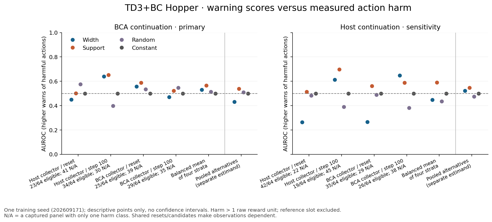
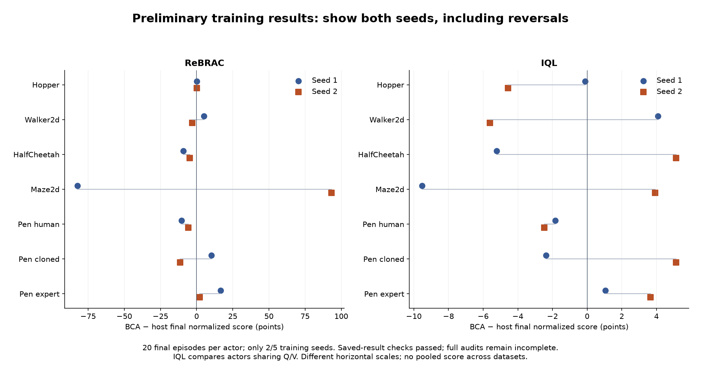
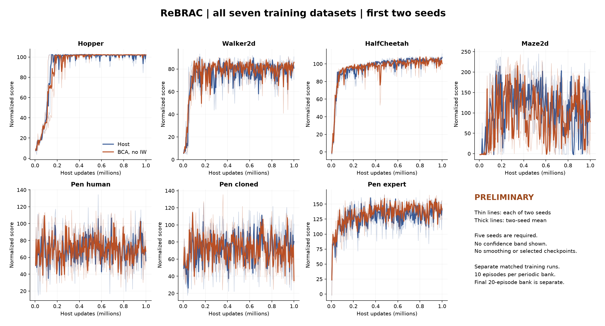
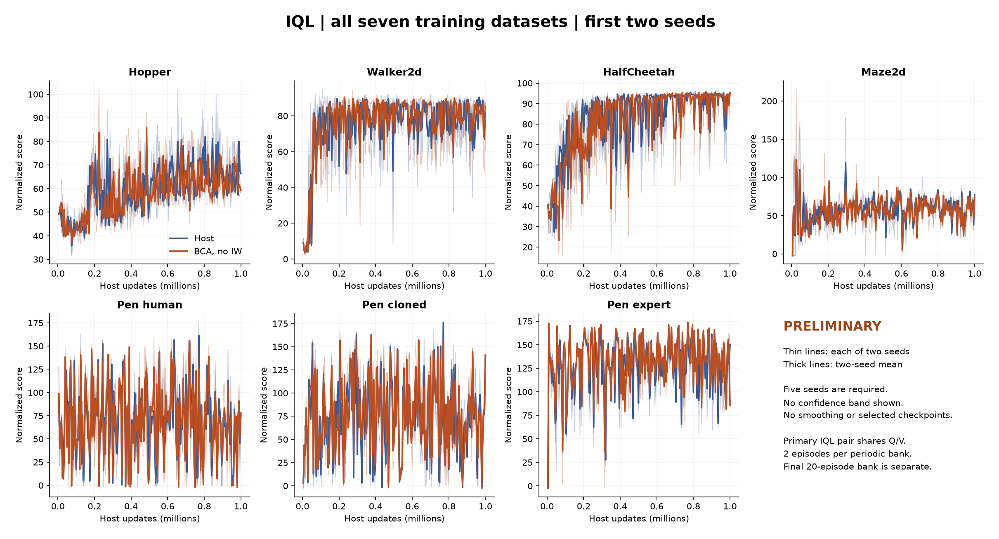

# BCA: advisor meeting brief — September 29, 2026

**Snapshot:** September 28, 6:35 p.m. EDT (22:35 UTC); saved evaluations extracted at 22:37 UTC. Standard BCA means both Bayesian and conformal components, without importance weighting of calibration fitting. Coverage and penalty settings are unchanged.

## What I would tell the advisor first

“The experiment asks whether BCA's prediction-error bands are useful for decisions involving poorly represented actions. We are testing two separate things: whether the bands warn about actions that actually hurt return, and whether the policy trained with BCA behaves better after those actions. The first TD3+BC Hopper seed does not yet show that benefit. Meanwhile, the cluster has completed two training seeds across all seven datasets for ReBRAC and IQL. Those training results vary by dataset and seed, so they cannot substitute for the OOD test. We are preserving the unfavorable results and completing the controlled follow-up before deciding whether importance weighting addresses a specific limitation.”

## 1. Why do this OOD experiment?

- **Research objective:** Determine whether standard BCA improves behavior when an action is poorly represented at the current state, and whether its width provides useful warning of harmful actions.
- **Why training curves are insufficient:** A higher average episode return can arise without better OOD handling. A lower Bellman residual can also coexist with poor action choices because its future-value target is itself a network estimate.
- **Why BCA might help:** Its learned residual scale can give different training examples different levels of caution. If that variation aligns with harmful action choices, the resulting training adjustment may improve the policy. This alignment is a hypothesis to test.
- **What this accomplishes:** It separates useful warning, better first-action choice, and better subsequent behavior. That tells us where an apparent benefit or limitation occurs and makes the next change defensible.

## 2. What are we doing, in plain language?

1. Train a plain host and its standard-BCA counterpart with the declared data, budget and seeds. BCA is active in the training objective after its first usable reference.
2. Freeze the resulting policies. Capture the complete simulator state from both policies' visits, so we can restore the same situation exactly.
3. Propose legal actions and measure how far each is from actions recorded in similar training states. This is an empirical support measure; unfamiliar does not automatically mean bad.
4. Save the candidate actions, randomness and BCA warning scores before measuring their consequences.
5. Restore the same state, impose one candidate action, then let the frozen host or BCA policy continue for up to 250 total steps. These simulator interactions are **evaluation**, not calibration fitting or further training.
6. Compare outcomes with a familiar reference action and compare both policies after the exact same imposed action. Repeat across states, support bands and independently trained seeds.

The completed v1 bank has ten actions per state and uses a host-action harm reference. The prospective v2 bank deliberately allocates near, moderately distant and strongly distant actions, uses the same recorded-action anchor for both policies, and separates action shift at familiar states from joint state/action shift. V2 is a declared follow-up after inspecting v1, not a retroactive change to v1.

## 3. Where does BCA enter, and what does calibration know?

| Host | BCA changes during training | What remains distinct |
|---|---|---|
| TD3+BC | Width-dependent multiplier on actor behavior cloning | Bellman critic targets retain the host rule |
| ReBRAC | Width-dependent multiplier on actor behavior cloning | Critic BC remains unchanged |
| CQL | Per-transition multiplier on the conservative critic gap | This is not a separate uncertainty penalty for every candidate action |
| IQL | Shrinks the capped actor advantage weight's excess above one | Primary actors share the same Q/V system |

BCA fits a positive scale to detached errors between Q predictions and the host's bootstrapped target. At reference refreshes, it uses reserved offline transitions to calculate Bayesian and conformal radii and keeps their maximum. Width combines the frozen scale, residual unit and radius. The calibrator does **not** know the true long-run Q-value and does **not** try actions in an environment during this procedure. The Bayesian component distributes mass over residual scores; it is not a collection of additional acting agents.

Ordinary policy evaluation uses frozen learned weights; no new penalty is added only at evaluation. The OOD study can query the frozen width as a diagnostic, but its rollouts do not update the policy or calibrator. Nominal 90% residual coverage is not 90% reliance on the old policy, nor 90% safe actions. Fresh OOD residual coverage has not been established by the current behavioral results.

## 4. What do good or bad results mean?

| Observation | What it supports | What it does not establish |
|---|---|---|
| Wider bands consistently rank harmful actions higher | Useful warning for the measured panel and continuation | Better policy return by itself, or universal OOD detection |
| BCA has higher return after the same unfamiliar action | Better subsequent behavior in that comparison | A better initial action, or the reason training improved |
| BCA loses less relative to the same familiar action AND has better absolute stressed return | Stronger evidence of useful action-stress robustness | A theorem or a guarantee for untested actions |
| BCA chooses a better first action with later policy fixed | Better local initial decisions | Broad whole-policy superiority |
| Width ranking is near chance | Little demonstrated separation of harmful and harmless actions | That conformal residual coverage is mathematically false |
| BCA underperforms on stressed actions | No benefit in that measured comparison | Proof of excessive conservatism or proof that IW will fix it |

For each outcome we report all declared seeds, missing captures and eligible states. Thousands of related actions are not thousands of independent training seeds. A nominally higher number from one seed is exploratory. The v2 protocol requires all five seeds and its predeclared uncertainty checks before a replicated directional claim.

## 5. Results we can present now

**Completed action study: TD3+BC Hopper, one training seed.** 5,120 recorded rollouts, 1,280,000 outcome steps, 256 captured rows from 64 shared reset blocks. Original interruption/recovery evidence is preserved.

| OOD diagnostic | Result | Meaning |
|---|---:|---|
| Width AUROC, equal-stratum mean of within-state rankings | 0.529 | Only slightly above chance descriptively |
| Support-distance AUROC, same aggregation | 0.566 | Higher than width in this seed |
| Fixed random / constant warning | 0.513 / 0.500 | Baseline context; no significance claim |
| Harmful alternatives under BCA continuation | 276 / 2,304 | Loss exceeds 1 raw reward unit versus host first action |
| Panels with both harm classes | 111 / 256 | Other panels' AUROC is undefined, not zero |
| BCA minus host first-action return, same BCA continuation | −0.120 | No average initial-action gain in this panel |
| Post-hoc distant-action return, BCA minus host continuation | −5.046 | BCA lower after the same imposed action |
| Post-hoc distant-action degradation advantage | −0.019 | Essentially no advantage relative to the common anchor |

The last two rows reuse 233 support-distant actions across 193 states from v1; they are a **post-hoc, unbalanced, one-seed bridge**, not the prospective v2 result. Distant actions improved average return relative to the chosen familiar anchor under both policies. Novelty and harm are different. These results do not yet demonstrate improved OOD handling by BCA.

**Independently accepted training comparisons: eight physical runs, four paired results.** These are whole-policy evaluations, not new OOD tests. Final scores use a separate twenty-episode bank. Periodic differences use the arithmetic mean of 200 periodic-bank means, not the final checkpoint's periodic evaluation.

| Host / dataset | Seed | Host final | BCA final | Difference | Periodic-mean difference |
|---|---:|---:|---:|---:|---:|
| TD3+BC / Hopper | 202609171 | 65.216 | 65.928 | +0.712 | -1.477 |
| ReBRAC / Hopper | 202609171 | 102.024 | 102.112 | +0.088 | +0.511 |
| ReBRAC / Walker2d | 202609171 | 77.331 | 82.311 | +4.981 | +0.945 |
| ReBRAC / Hopper | 202609172 | 101.956 | 102.038 | +0.082 | -1.771 |

ReBRAC Hopper is now independently accepted for **two of five seeds**. Its final differences are tiny, and its second-seed periodic mean is lower with BCA. ReBRAC Walker's first-seed higher mean coexists with a lower median and only 7/20 paired episode wins. The full five-seed conclusions remain pending.

## 6. What does the cluster show?

**56/140 cluster runs have successful process and learner exit receipts:** 28 ReBRAC and 28 IQL; both methods on all seven datasets for seeds 202609171 and 202609172. The live third-seed ReBRAC Hopper host was at 475,000 updates when inspected. Its original controller and worker identities matched. The cluster continued through the desktop interruptions.

The following is a **preliminary saved-evaluation readout**, not full acceptance of all training results. Result hashes match the queue; actual exits, budgets, evaluation artifact hashes/counts, finite scores and paired reset-bank equality were checked. Source/data reconstruction, full journals and checkpoint counters for the remaining runs still require their independent audits. Six cluster physical runs plus two local runs have those full accepted audits; **50 cluster closures remain pending full audit** at this snapshot.

IQL compares its two actors within the same BCA run, sharing Q/V. Its separately trained host is context only and is retained in the data export. No standalone IQL host is silently substituted into the primary pair. These scores are local candidates, not the published Unifloral/CORL means.

| Host / dataset | Seed 1: host → BCA | Seed 1 difference | Seed 2: host → BCA | Seed 2 difference |
|---|---:|---:|---:|---:|
| ReBRAC / Hopper | 102.02 → 102.11 | +0.09 | 101.96 → 102.04 | +0.08 |
| ReBRAC / Walker2d | 77.33 → 82.31 | +4.98 | 87.81 → 84.82 | -2.99 |
| ReBRAC / HalfCheetah | 111.04 → 101.74 | -9.29 | 101.23 → 96.50 | -4.73 |
| ReBRAC / Maze2d | 124.58 → 42.16 | -82.42 | 64.67 → 157.88 | +93.21 |
| ReBRAC / Pen human | 70.54 → 60.09 | -10.45 | 56.96 → 51.15 | -5.81 |
| ReBRAC / Pen cloned | 68.34 → 78.49 | +10.15 | 81.55 → 70.21 | -11.34 |
| ReBRAC / Pen expert | 135.27 → 151.80 | +16.53 | 146.92 → 148.91 | +1.99 |
| IQL / Hopper | 65.75 → 65.63 | -0.12 | 64.80 → 60.23 | -4.57 |
| IQL / Walker2d | 79.76 → 83.86 | +4.09 | 80.01 → 74.39 | -5.62 |
| IQL / HalfCheetah | 93.48 → 88.27 | -5.21 | 87.66 → 92.79 | +5.13 |
| IQL / Maze2d | 71.20 → 61.67 | -9.52 | 61.84 → 65.77 | +3.93 |
| IQL / Pen human | 71.73 → 69.90 | -1.83 | 69.81 → 67.33 | -2.47 |
| IQL / Pen cloned | 81.99 → 79.63 | -2.37 | 76.10 → 81.24 | +5.14 |
| IQL / Pen expert | 136.61 → 137.66 | +1.05 | 139.78 → 143.43 | +3.65 |

The two-seed pattern is mixed: ReBRAC HalfCheetah and Pen-human are lower with BCA in both seeds; ReBRAC Pen-expert is higher in both. IQL Hopper and Pen-human are lower in both, while Pen-expert is higher. Several other cells reverse sign. ReBRAC Maze's −82.42 then +93.21 illustrates why a favorable seed cannot be selected as the conclusion. No confidence interval or cross-dataset aggregate is claimed from this partial grid.

## 7. Why has the OOD study only finished one seed?

- The first action study was interrupted by two desktop restarts. Completed trajectories were preserved; partial attempts and recovery overhead remain documented. Recovery and independent saved-outcome checks consumed time.
- The subsequent request for a more direct OOD-action test led to a prospective support-balanced follow-up. Future unstarted v1 collection is held while that version is integrated; no v2 scientific collection is running yet.
- Runtime, storage, shared-resource and simulator-adapter acceptance are still pending. Many synthetic component tests have passed, but those are engineering progress, not additional scientific results. This execution/integration and audit backlog is the bottleneck.
- The local training lane is separately stopped on a CQL evaluation-schema failure after final evaluation. Its original failure and outputs remain preserved; it has not been silently retried. Cluster training is still active.
- The one v2 candidate-seed overlap is now corrected under explicit approval. The full 16,640-stream check passes with exactly one changed assignment. This removes that blocker but does not pass the remaining execution gates.

It would be inaccurate to say only one training seed exists, or to promise that all five OOD seeds will finish before the meeting. The immediate deliverable is the verified first study, transparent preliminary cluster results, and an explicit path to replication.

## 8. Justify each design choice or change

| Choice / change | Why it makes sense | Expectation and current check |
|---|---|---|
| Start with BCA without fitting IW | Isolates the basic calibration-to-host mechanism | Useful width/behavior is not yet demonstrated by v1 |
| Same data reservations, host settings and training budget | Reduces explanations based on unequal data or training | Pair audits verify them; remaining cluster audits pending |
| Freeze policies and restore full simulator state | Keeps comparisons tied to the same learned agents and situation | v1 first-repeat gates passed; v2 must archive complete final states |
| Hold later policy fixed when testing first actions | Separates initial action quality from continuation quality | v1 BCA-first effect is about −0.120 under BCA continuation |
| Impose identical actions under both continuations | Tests what happens after the same unfamiliar move | Post-hoc v1 bridge does not show a BCA advantage |
| V2 near/moderate/strong support bands | Ensures the test deliberately includes different degrees of action novelty | Prepared using training data only; v2 outcome results pending |
| Same familiar anchor, plus absolute stressed return | Prevents a weak familiar baseline from making degradation look artificially good | Report both contrasts; never choose each policy's own best action as the main reference |
| Separate state novelty and action novelty | Avoids attributing joint shift entirely to unfamiliar actions | State-near primary and joint-shift sensitivity are predeclared |
| Five training seeds | Tests whether findings survive training randomness | Two cluster seeds exist; OOD replication is incomplete |
| One approved candidate-seed correction | Removes a declared identifier collision before v2 outcomes | Exactly one change; 16,640 unique streams, no predecessor overlap |
| Hold coverage/strength tuning | Avoids changing several mechanisms after seeing a weak result | No coverage or penalty-strength setting changed |

## 9. What do we do next, and when is IW justified?

1. Finish the real v2 execution checks using the already accepted trained pairs; do not treat synthetic fixture success as simulator acceptance. Keep full state/action/reward archives and the cumulative step cap.
2. Continue fixed-order audits of newly completed cluster runs. Reuse accepted exports and present all declared seeds, including losses and reversals.
3. Execute the support-balanced OOD protocol on accepted eligible pairs, then read out initial-action quality, continuation robustness and warning ranking separately. First tranche is TD3+BC/ReBRAC × Hopper/Walker × five seeds; IQL/CQL training does not automatically mean those OOD studies are finished or ready.
4. Diagnose the limitation before proposing the next weighting rule. If the scale fits commonly seen transitions well but fails on the state–action regions relevant to the intended policy, a separately declared fitting-weight change is a plausible hypothesis. If width ranks harm well but behavior remains poor, the width-to-host adjustment may instead be the issue. If the residual target is weakly related to outcome harm, changing weights alone may not fix it.
5. For a future IW comparison, state the target population, exact weights and assumptions, compare with no-IW under matching budgets/seeds, monitor effective sample size, and retain both Bayesian and conformal components. Stronger weights can emphasize the wrong examples or reduce effective data. The current unweighted radius stage is not automatically a weighted-conformal covariate-shift guarantee.

**Suggested wording:** “We start with standard BCA to locate its strengths and limitations. We will test importance weighting if we identify a mismatch it is designed to address. Better weighting is an empirical hypothesis; weak vanilla results alone do not establish its necessity or benefit.”

## Evidence and access

- [Per-seed cluster results](cluster_pair_results.csv); [saved episode/curve arrays](preliminary_cluster_evaluations.json.gz); [live cluster snapshot](cluster_live_status.json).
- [Original accepted OOD report](../../ood/td3_bc/hopper/s202609171/real-harm-report-v1/report.html); [post-hoc bridge and limitations](../../ood/robustness-v2/preparation-v1/README.md).
- [BCA pseudocode](../../../ALGORITHMS.md); [exact integration points](../../../INTEGRATION.md); [approved one-stream amendment](../../../docs/OOD_V2_STREAM_AMENDMENT_20260928.md).
- Historical OOD limitations remain: unavailable 5,121 final following full-state contents, unknown ancestor exits and one input-only historical outcome, with all reservations retained. No missing evidence is invented. Fresh residual coverage and global OOD readiness remain unaccepted.
- This brief performs no training, model query or simulator step. It changes no scientific setting, old result, frozen source or thesis PDF. All original failures and negative outcomes remain available.
