# BCA experiment update — 29 September 2026

Standard BCA has not yet shown a consistent performance benefit. The new CQL endpoints are weaker; TD3 Walker improves its final mean but is weaker on average during learning. We now have clear training comparisons, but the revised OOD study has no completed pair yet.

This report contains 94 completed or recovered physical training runs, 115 saved actor trajectories, and 46 available within-seed host/BCA comparisons. Only 8 training pairs have completed the separate independent review. Additional extracted comparisons are preliminary. These counts describe different units and must not be added together.

Training snapshot: 2026-09-29T12:59:00.054964+00:00 through 2026-09-29T13:01:10.600999+00:00; IQL saved-array extraction finished 2026-09-29T13:02:24.766158+00:00. OOD worker status: 2026-09-29T12:52:19.699943+00:00. These are timestamped snapshots, not a live page.

## What has changed

- CQL now supplies completed 1M-update comparisons on Hopper and Walker. The original CQL host output-schema failure was recovered from saved evidence without training again; its original process exit 1 remains recorded.
- TD3 Walker's first training pair passed independent saved-data review. TD3 HalfCheetah's host finished during extraction; its BCA partner was running and no completed comparison is reported for that cell.
- All available completed curves are organized into four host atlases covering all seven declared datasets. Unfinished cells are visible. IQL's primary comparison uses the two actors sharing nuisance Q/V, with its standalone host shown separately.

## New comparisons: same training seed, 1M host updates

| Comparison | Host final | BCA final | Final difference | Difference in mean periodic curve | Evidence |
|---|---:|---:|---:|---:|---|
| CQL Hopper | 62.98 | 56.79 | -6.19 | +0.07 | Independent review pending |
| CQL Walker | 80.13 | 63.88 | -16.25 | -0.72 | Independent review pending |
| TD3+BC Walker | 77.25 | 82.90 | +5.65 | -2.22 | Independent review passed |

Final return averages 20 reserved final episodes. Mean periodic curve averages all 200 equally spaced evaluation-bank means from 5k to 1M updates; it is not best-checkpoint performance. These selected hosts use 10 episodes per periodic bank. One training seed per new pair does not provide a training-seed uncertainty estimate. CQL Hopper used different hardware for host and BCA (local RTX 5070 Ti versus cluster A100).

TD3 Walker wins 8/20 paired final resets despite its positive final mean. CQL Walker wins 11/20 despite its negative final mean. Large gains or losses on a subset of resets can drive an average; the final-reset plot shows all of them.

## Answers for the advisor

**Why are we doing this?** Offline policies can propose state–action combinations with little relevant dataset support. We need to test whether BCA's warning signal helps identify actions whose actual continuation outcomes are worse, and whether the host uses that signal beneficially.

**What does the current comparison change?** It adds standard BCA with equal calibration-fitting weights while retaining Bayesian and conformal components. The base host is the comparison; importance weighting is not yet the treatment in these plots. IQL's paired actors share nuisance Q/V, so the comparison is about their actor treatment, not separately improved critics.

**What do the training results accomplish?** They show whether the complete learned policy performs better and how performance changes during learning. They do not tell us whether BCA correctly ranks the danger of individual unfamiliar actions.

**Why is the evidence of benefit still weak?** The new pairs have one training seed, endpoints and learning-time averages differ, and seed effects can change sign. In the reviewed ReBRAC Walker trio, the BCA-minus-host final differences are +4.98, −2.99 and +33.64: the average +11.88 is strongly affected by one seed. Reviewed ReBRAC Hopper is nearly tied on average (−0.03). The OOD mechanism test is still incomplete. This supports a cautious conclusion, not a claim that BCA universally helps or universally fails.

**What would a good OOD result mean?** Within the same simulator state, larger BCA warnings would consistently track actions with worse measured continuation outcomes across matched seeds. If the policy also chooses better actions with lower candidate-set regret, that would support useful decision guidance in the tested panel. Neither finding alone is a universal OOD detector or proof of conformal coverage under arbitrary shift.

**What would a bad OOD result mean?** If widths fail to rank harmful actions, the signal is not useful for that panel and continuation policy. If ranking is useful but choices or returns worsen, the place or strength of BCA's influence on the host needs investigation. If nominal coverage misses its target, assess the calibration assumptions and target being covered separately. These are different failure modes; return or Q loss cannot diagnose all of them.

**What happens next, and why?** Finish and verify the five active OOD pairs, then report within-state harm ranking, actual action outcomes and candidate-set regret with the protocol's fixed horizons, seeds and gates. Continue the declared remaining pairs and independent training reviews. Keep current coverage/settings fixed so the baseline remains interpretable. Only after establishing the standard-BCA limitation should a separately specified weighted-conformal treatment be compared. Weighted scale fitting by itself is not weighted conformal prediction; the target distribution, ratio estimator, weighted quantile and test-point mass require their own validated implementation. We should not assume importance weighting will repair every failure mode.

## OOD execution and the remaining gap

Five revised pairs are active: local TD3 Hopper seed171, plus cluster ReBRAC Hopper171 and Walker171/172/173. Zero of the 20 pairs in this tranche is complete; 15 have not started. Both cluster A100 allocations were also active on the training queues at the recorded check. OOD simulation runs on CPU workers, so the GPU training speed does not determine how quickly these interventions finish.

The progress figure counts explicit simulator transitions, including setup and collection. It is not a completion percentage, not a scientific comparison, and not an ETA. The TD3 count includes its preserved pre-interruption prefix and continuation. No active scientific SQLite database was opened by this plotting update. Final OOD harm, coverage and regret charts remain unavailable until the pairs close and pass verification; old pilot outcomes are not relabeled as new evidence.

## How to read the plots

### New completed learning curves

Read left to right through 1M updates. Every periodic mean is shown without smoothing. The diamonds use a separate final reset bank. CQL training results are preliminary pending independent review; TD3 Walker is reviewed. CQL Hopper compares a local RTX 5070 Ti host run with an A100 BCA run. These are policy-performance results, not action-level OOD results.

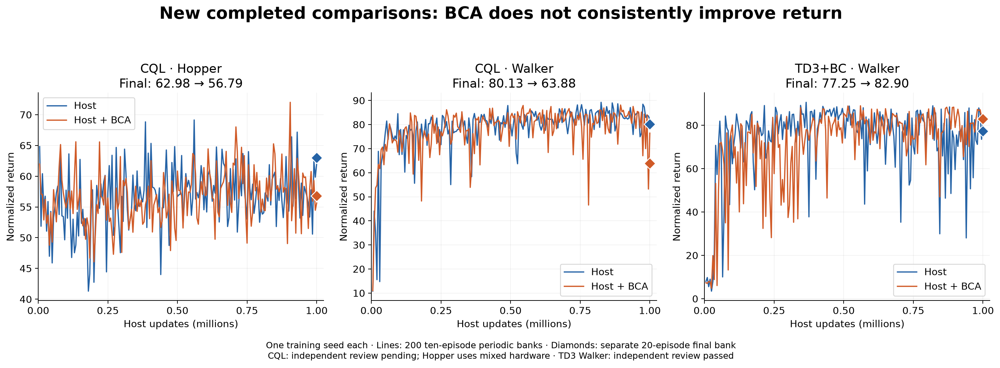

### Endpoint versus performance during learning

Positive values favor BCA. TD3 Walker improves the final mean but has a lower average periodic score; it wins only 8 of 20 paired final resets. These are distinct questions, not conflicting calculations. One training seed per pair cannot estimate training-seed uncertainty. CQL figures await independent review.

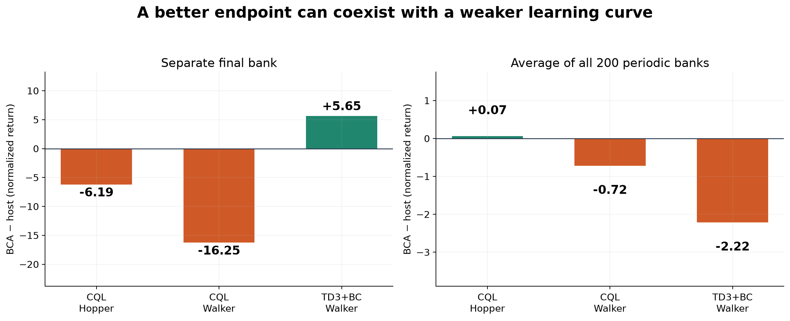

### Final-reset differences

Each dot compares host and BCA from the same final reset seed, with fixed trained policies. All 20 resets appear in their recorded order. TD3 Walker has a positive mean despite only 8 positive resets; CQL Walker has a negative mean despite 11 positive resets. This is variation over environment resets, not 20 independent training seeds, and does not isolate action-level harm.

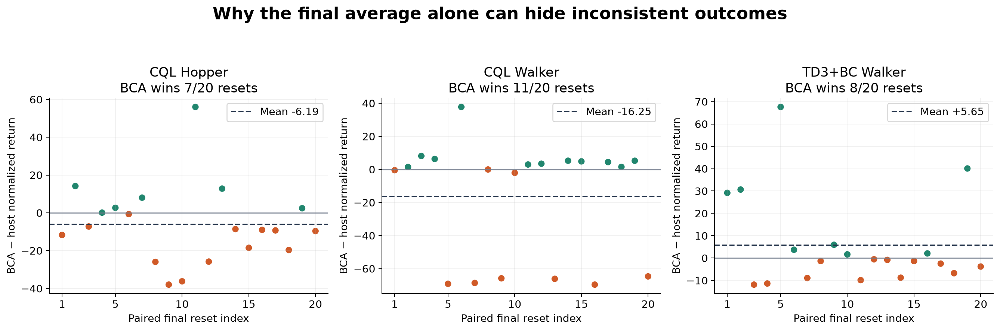

### TD3+BC learning-curve atlas

The same completed training seeds are used for both methods in each colored comparison. Shading describes variation among the available seeds; it is not a confidence interval or final five-seed conclusion. Unpaired completed runs are gray dashed context. Most atlas rows await the complete independent source/data/checkpoint audit; exact status appears in the per-seed table. No best-seed or best-checkpoint selection.

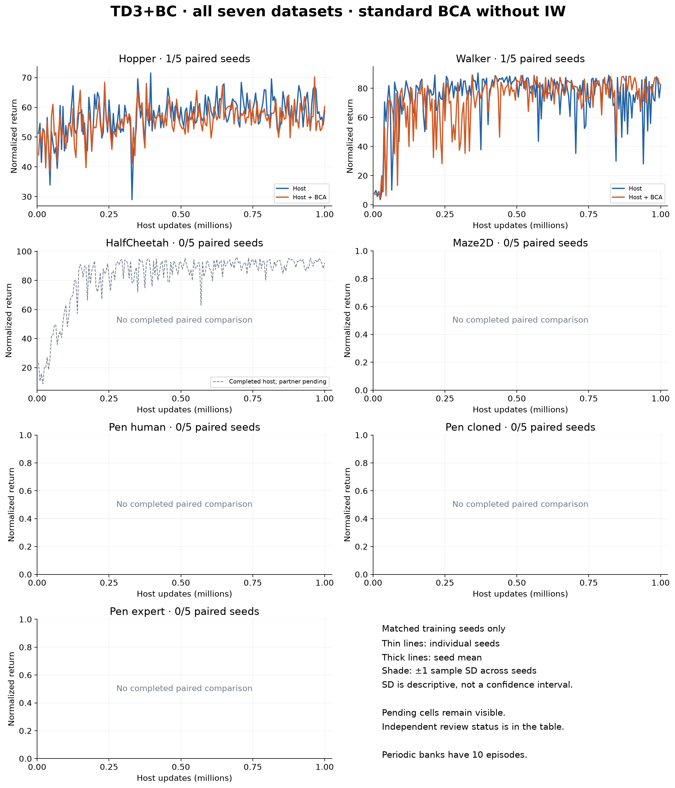

### CQL learning-curve atlas

The same completed training seeds are used for both methods in each colored comparison. Shading describes variation among the available seeds; it is not a confidence interval or final five-seed conclusion. Unpaired completed runs are gray dashed context. Most atlas rows await the complete independent source/data/checkpoint audit; exact status appears in the per-seed table. No best-seed or best-checkpoint selection.

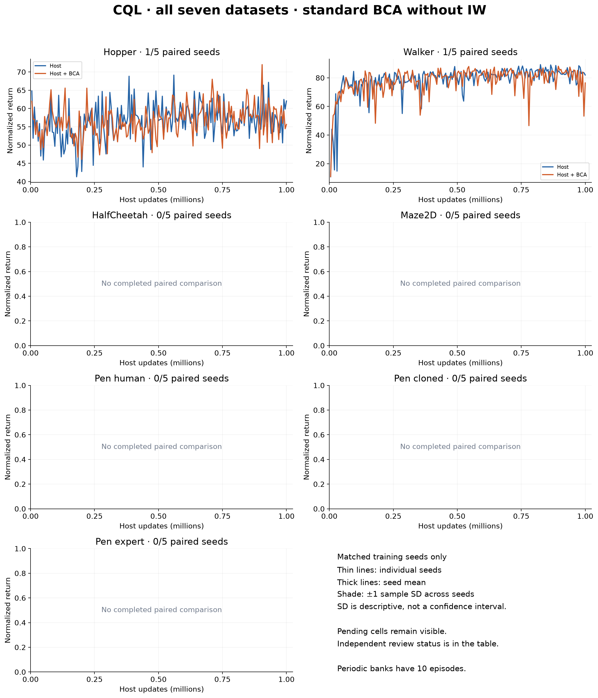

### ReBRAC learning-curve atlas

The same completed training seeds are used for both methods in each colored comparison. Shading describes variation among the available seeds; it is not a confidence interval or final five-seed conclusion. Unpaired completed runs are gray dashed context. Most atlas rows await the complete independent source/data/checkpoint audit; exact status appears in the per-seed table. No best-seed or best-checkpoint selection.

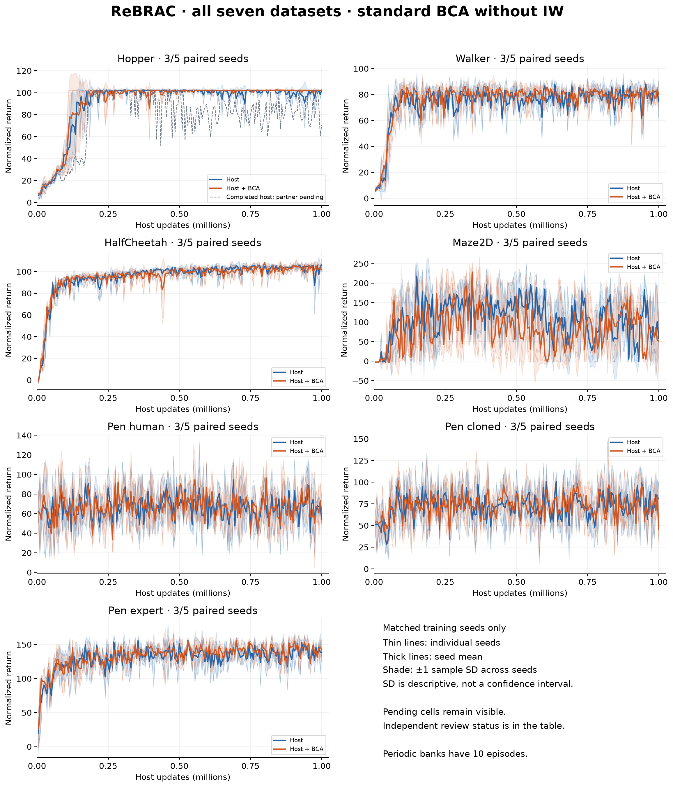

### IQL learning-curve atlas

The same completed training seeds are used for both methods in each colored comparison. Shading describes variation among the available seeds; it is not a confidence interval or final five-seed conclusion. Unpaired completed runs are gray dashed context. IQL compares its paired actors sharing the same learned Q/V; the separately trained host is shown only as dotted gray context. Most atlas rows await the complete independent source/data/checkpoint audit; exact status appears in the per-seed table. No best-seed or best-checkpoint selection.

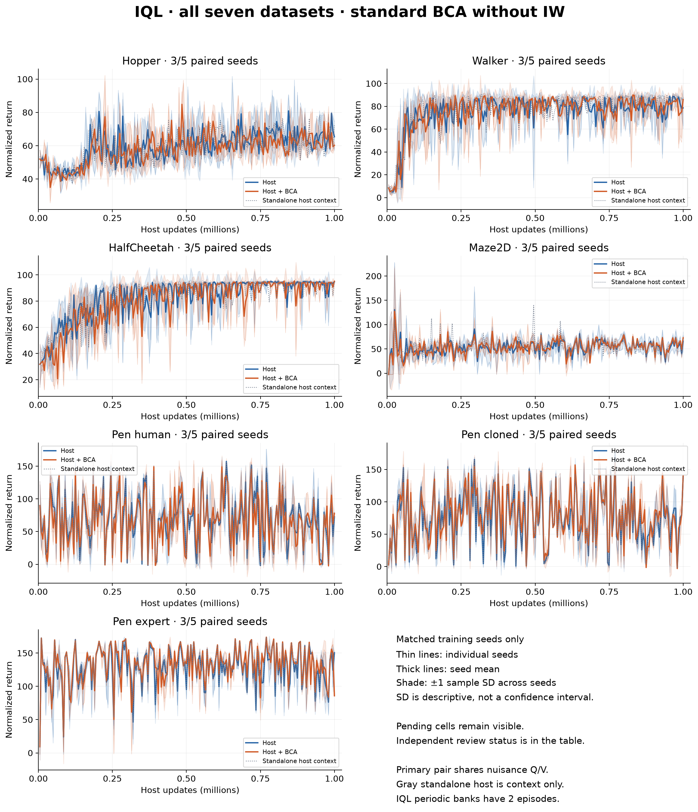

### Reviewed ReBRAC training-seed comparisons

Each line connects the two final 20-episode means for one paired training seed. Agreement across seeds is stronger evidence than a single endpoint; three seeds remain short of the planned five. The lines describe whole-policy performance, not whether BCA correctly identifies harmful actions.

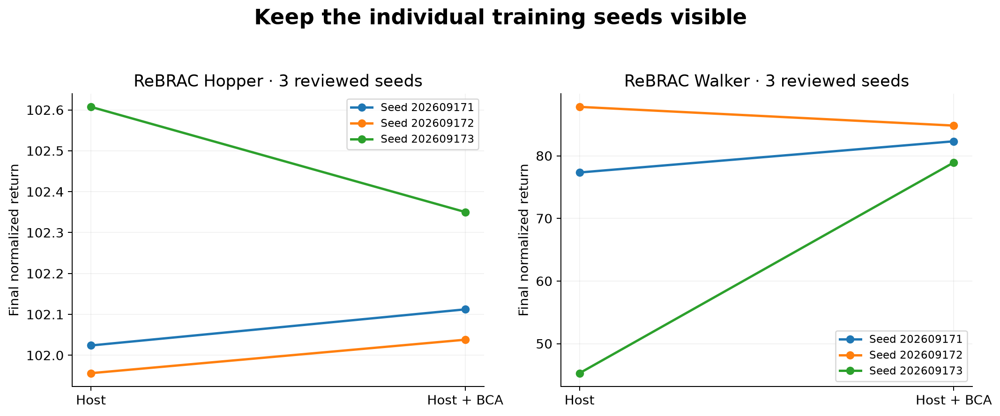

### TD3 Walker calibration during training

198 recorded refreshes retain both Bayesian and conformal radii; the effective radius is their maximum. The actor’s behavior-cloning penalty is multiplied by the BCA signal. The scale and critic plots use audited 1,000-update block means; actor statistics exclude skipped actor updates. Successful fitting does not show that width ranks OOD harm correctly.

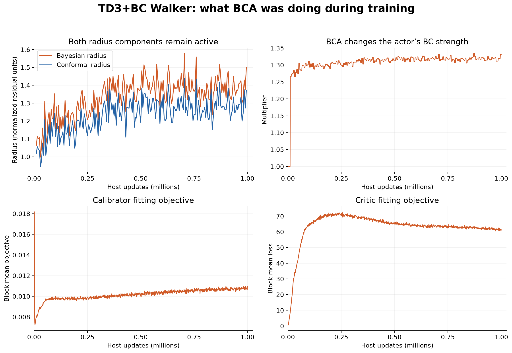

### CQL Q and loss diagnostics

These are 1,000 sparse last-row snapshots per completed run, not means over all updates. Q1 is evaluated on recorded dataset actions. Different Q/loss trajectories can help locate a mechanism to investigate, but cannot establish which proposed actions cause harm. Original CQL host failure/recovery remains preserved; the new CQL runs still await independent review.

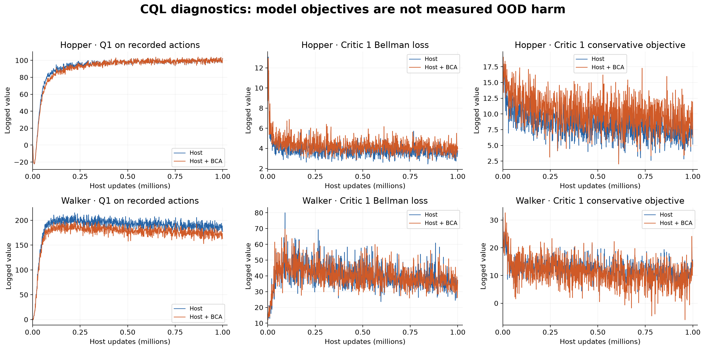

### CQL calibration signal

Sparse last-row snapshots show the multiplier used on CQL’s conservative objective and the fitting objective. Both runs record 198 successful posterior refreshes. Historical numerical radii are not in these CQL refresh records, so no radius history is fabricated. Sampled fit acceptance is not a complete per-update acceptance log; independent final checkpoint-counter review is still pending. A nonzero multiplier alone does not demonstrate useful harm ranking.

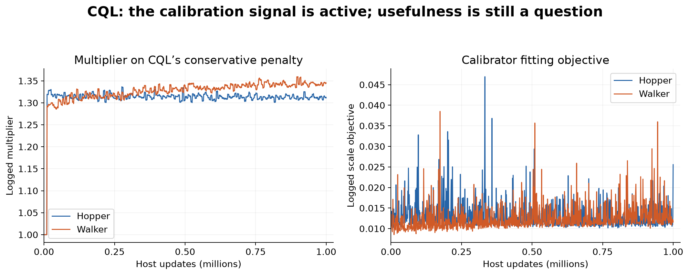

### OOD execution progress

Four cluster CPU workers and one local continuation worker are running the five pairs. Bar length counts recorded explicit transitions, including engineering checks and collection; different episode lengths prevent direct conversion to percent complete. TD3 includes its preserved original prefix plus its continuation. No revised pair is complete, so final harm-ranking, coverage and regret findings are unavailable. No live scientific database was read for this report.

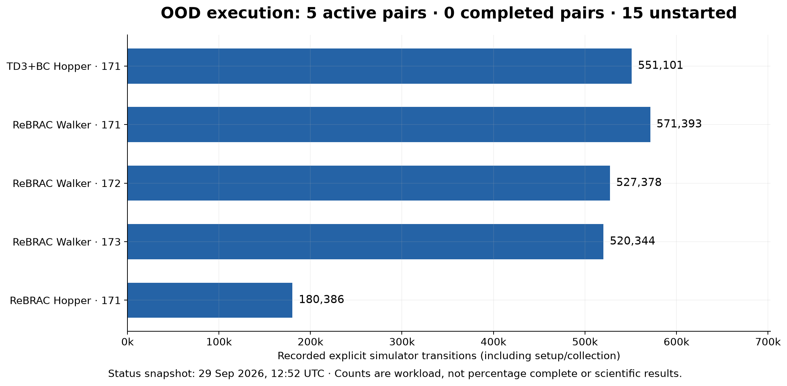

## Definitions and evidence boundaries

- Training runs, actor trajectories, paired training comparisons and completed OOD comparisons are different counts. IQL accounts for the extra actor trajectories.
- The declared training matrix remains 280 physical runs / 315 actor trajectories; this report contains 94 produced results, including one recovered original failure. Remaining results are not assumed successful.
- Atlas shading is ±1 sample standard deviation across the available matched training seeds. It is descriptive dispersion, not a confidence interval. Periodic IQL banks have two episodes; other hosts have ten. Every final bank has 20.
- The paired table reports the exact same completed seed set for host and BCA in each cell. An unmatched finished host is plotted as gray context and excluded from paired means.
- CQL scalar diagnostics are 1,000 sparse last-row observations, not all one million updates. TD3 diagnostic curves use audited block means with actor skips handled by the exporter.
- All figures retain raw plotted values. No smoothing, score-based filtering, best-seed selection, training change, simulator run or checkpoint query was performed to make this report.
- Source/configuration/result hashes and exact bank values accompany the report. Hash and bank checks on preliminary outputs do not substitute for the full independent source/data/checkpoint audit.
- All comparisons are current local controls. External published means and older campaigns are not substituted into these pairs. No main research PDF was changed.

## Calculations

For periodic bank j in seed s, score m(s,j) is the arithmetic mean of that bank's episode scores. The learning-time summary is (1/200) × sum over j of m(s,j). The final result f(s) is the mean of the separate 20 final episodes. The paired effects are f_BCA(s) − f_host(s) and curve_BCA(s) − curve_host(s). Across seeds, average the seed-level effects equally; do not treat evaluation episodes as additional independent training seeds. Final-reset dots subtract the two policies' returns under the same reset seed.

Candidate-set regret for the forthcoming OOD panel is max over tested candidate actions of measured return minus the selected action's measured return, within a fixed state and continuation setup. It measures regret among tested candidates, not regret against the unknown optimal action.
