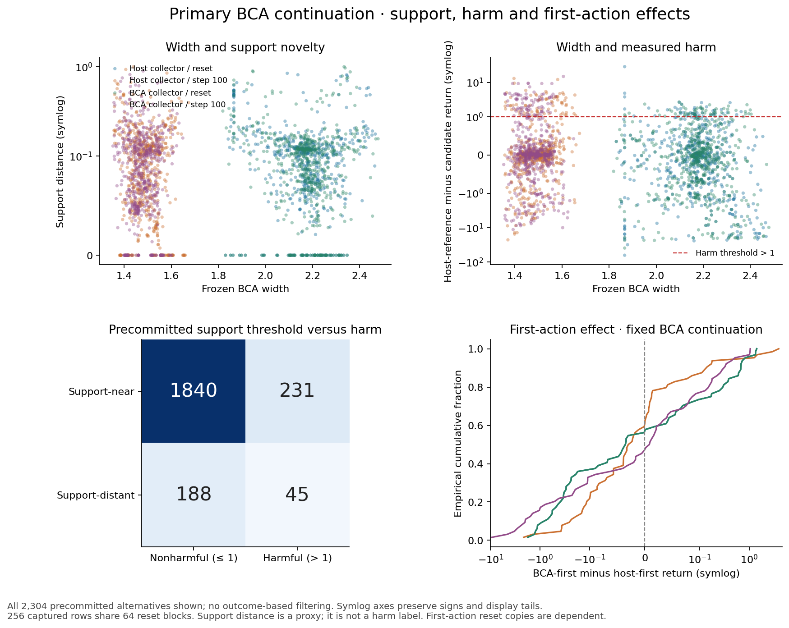
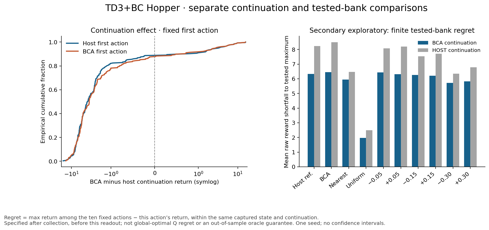

# First exploratory action-harm readout: TD3+BC Hopper

**Width did not outperform the support-distance warning in this first seed’s primary summary.** The equal-stratum mean within-state AUROC was **0.529 for width**, **0.566 for support distance**, and **0.513 for the precommitted random score** (constant score: 0.500). These are descriptive observations, not a five-seed conclusion.

Under the primary frozen BCA continuation, **276/2304 alternatives (11.98%)** lost more than one raw reward unit relative to the host first action. Ranking was estimable in **111/256 captured panels**; the other **145** had one harm class and AUROC/AP are N/A. Each panel uses nine alternatives; the reference slot is excluded.

## Primary ranking by collector and capture time

| Captured-state stratum | Eligible / 64 (N/A) | Harmful / 576 | Width AUROC | Support AUROC | Random AUROC |
|---|---:|---:|---:|---:|---:|
| Host collector / reset | 23 (41) | 48 | 0.449 | 0.501 | 0.576 |
| Host collector / step 100 | 34 (30) | 77 | 0.640 | 0.652 | 0.397 |
| BCA collector / reset | 25 (39) | 59 | 0.557 | 0.588 | 0.534 |
| BCA collector / step 100 | 29 (35) | 92 | 0.471 | 0.522 | 0.546 |

The primary summary gives each of the four strata equal weight after averaging eligible panels within that stratum. Pooling the 111 eligible panel AUROCs instead gives width 0.538 and support 0.572; this weights strata differently. Pooling all 2,304 alternative actions before computing AUROC gives **width 0.432 and support 0.539**, a separate estimand affected by across-state comparisons. Ties receive half credit. We retain both collector banks at shared resets, so these pooled entries are not independent physical samples.

The host-continuation sensitivity summary gives equal-stratum within-state AUROC **width 0.448, support 0.590**, with 122/256 eligible panels. Its pooled width AUROC is 0.522. Do not combine the two continuations as independent seeds.

## Support proximity and measured harm

At the fixed support-distance threshold, the primary alternatives comprise 1840 near/nonharmful, 231 near/harmful, 188 distant/nonharmful and 45 distant/harmful actions. Thus most harmful alternatives (231/276) are still support-near, and most distant alternatives (188/233) are nonharmful. Support novelty and action harm are different measurements.

Both radius components remain visible: Bayesian 1.019587636, conformal 0.961083055, effective radius 1.019587636, fixed unit 1.354202986. One positive global radius cannot improve action ordering. Native host width is unavailable. The stored support bank has 233 distant slots out of 2,560 fixed slots; none of those distant slots is the reference here.

## First action, continuation and secondary regret

With BCA continuation held fixed, switching only the first action from host to BCA changes the raw return by a mean **-0.120** and median **-0.022** across 256 captured rows. With host continuation fixed, the corresponding mean is **-0.248**. These first-action effects are separate from changing the continuation at a fixed first action; the latter are exported for every state/slot and shown below for host/BCA first actions.

**Secondary, exploratory tested-bank regret** is the maximum saved return among the ten precommitted unique actions minus the selected action’s return, within one state and continuation. Under BCA continuation the mean regret is **6.333** for the host first action and **6.453** for the BCA first action. This endpoint was specified after collection and before this readout. It is not globally optimal Q regret, a claim about untested actions, or an out-of-sample selection guarantee. Tied maxima have zero regret. It does not replace host-reference harm.

## Evidence and limits

All 5,120 recorded 250-total-transition undiscounted returns are covered by the accepted three-attempt saved-outcome audit. Original/first-recovery/current completed action counts remain 1,438/2,761/921. Both interrupted partial traces are excluded. The two ancestor exits and one historical input-only physical output remain unknown, with all reservations retained. No model, simulator, new worker, raw archive or ledger was opened to produce this report.

This is **one training seed, 256 captured rows and 64 shared paired reset blocks**. Reset states, candidate actions and both continuations are dependent. All five declared training seeds remain required; no action-based or five-seed confidence interval is supplied. Several strata have few eligible panels. An accepted return, a training gain or these exploratory AUROCs do not establish generally useful OOD ranking.

The original full first-transition repeat/restore gate passed. The acceptance explicitly lacks 5,121 final following full-state contents (5,120 completed last steps and one excluded partial last output); last-output controls, reward fields, hashes and return-array entries were checked. Constructor receipts reconcile separately, without independently archived constructor rewards/post-states. No missing state was invented. Fresh residual coverage and global readiness remain false; ReBRAC’s unavailable recorded-next-action coverage target is unchanged.

## Exact data

- [Long-form observations (CSV)](observations.csv) and [exact JSON](observations.json)
- [Panel metrics, AP, loss ranks and complete-tie risk retention](panels.json)
- [Stratum metrics (CSV)](strata.csv) and [full summaries](summary.json)
- [Fixed-first-action continuation effects (CSV)](continuation_effects.csv)
- [Exact plotted numeric arrays and sources](plot_data.json)

The real adapter passed 18 synthetic arithmetic/refusal tests (including four regret tests) and six file-binding tests without skips. Independent readback verified every exported harm/regret value, panel AUROC/AP, risk-retention tie group, stratum/pooled denominator and CSV roundtrip. Source and accepted-input hashes are recorded in the accompanying evidence package. The original synthetic report.py and all frozen science remain unchanged.
