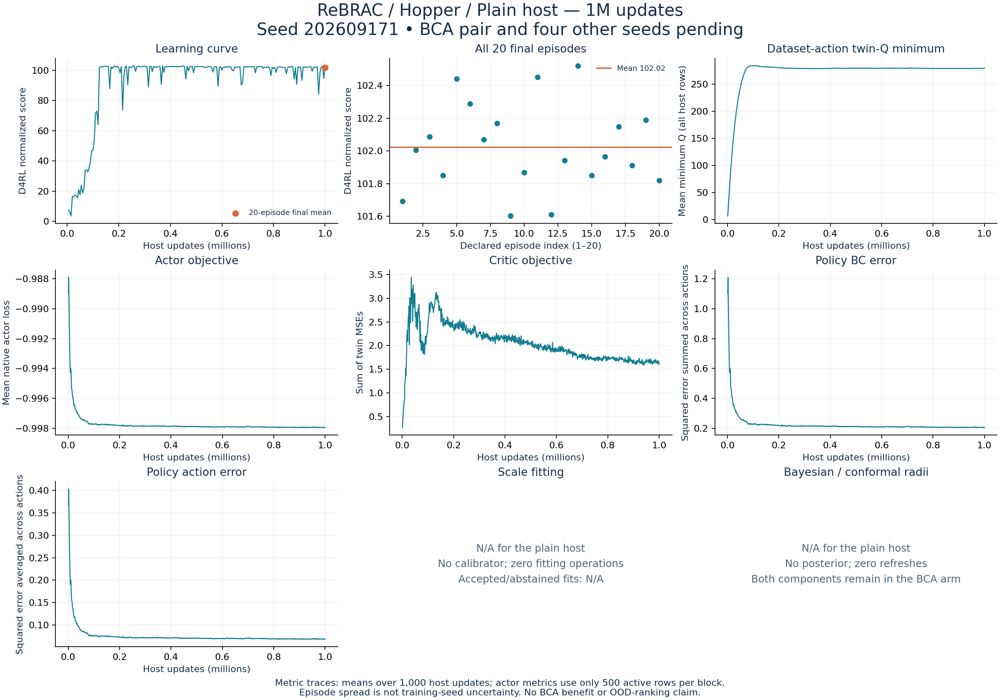

# ReBRAC / Hopper / Plain host: first standard-study 1M result

Run `rebrac-hopper-host-s202609171` is independently verified complete. The final
20-episode mean is **102.0239558**, and the mean of all 200 periodic-bank means is
**92.5215207**. Its no-IW BCA counterpart is running. This is one training seed;
the paired BCA comparison and training-seed uncertainty remain pending.

| Saved-return summary | Value |
|---|---:|
| Final 20-episode mean | 102.0239558 |
| Mean of 200 ten-episode periodic banks | 92.5215207 |
| Same 1M checkpoint, periodic bank | 102.0957005 |
| Final episode median | 101.9857864 |
| Final episode sample SD | 0.2670320 |
| Final episode range | 101.6014989–102.5219434 |
| Completed training seeds | 1 of 5 |
| Paired BCA comparisons | 0 of 5 |

All 20 original final episodes are retained. Episode spread and the difference
between periodic and final banks are reset variation, not training-seed
uncertainty. The periodic mean and median do not replace the final mean. This
host result establishes neither a BCA benefit nor useful OOD ranking. Published
scores and the old halted campaign retain their separate protocols and results.

## Verified execution and provenance

The actual worker exited 0 at 2026-09-27T20:26:11.243970+00:00, without timeout
or interruption; the learner receipt also records success. The existing cluster
controller continues its declared queue and has no final exit yet. The CPU audit
checked the frozen manifest and all 108 source files, resolved settings, actual
cache bytes and raw/converted arrays. Reconstructed training and holdout
transitions match their saved hashes, including recorded next actions; the
training fingerprint matches the accepted paired-data preflight.

There are 998,895 training rows, 1,103 held-out rows and no posterior reference
rows. Observation normalization is disabled; Hopper observations and rewards
remain raw. Native settings retain actor/critic BC coefficients 0.01/0.01,
batch 1024, actor/critic learning rates 0.001/0.001, discount 0.99, target rate
0.005, policy noise 0.2 clipped at 0.5, actor delay 2, and Q normalization. Actor
layer normalization is off and critic layer normalization is on.

All three 10k/50k/1M checkpoints match their recorded hashes. Decoded host and
optimizer counters confirm 1M critic updates and 500k actor updates. Native
target parameters are embedded in the actor/critic states and are finite. The
frozen schedule updates them 500k times; this format has no independently saved
target-update counter. Checkpoint training RNG hashes agree with the matching
journal scans. Journal state hashes are retained, but are not reconstructed from
a differently ordered serialized tree.

The complete gzip journal has 1,000 accepted scan blocks, 1,203 phase markers,
200 ten-episode periodic banks, one twenty-episode final bank and its terminal
completion marker. All 2,020 episode identities and score transformations agree
with the declared banks and result. No posterior refresh or failed event occurs.

Calibrator, posterior and residual-scale fields are None. Fitting and refresh
operations are zero by design. Accepted/abstained fitting statistics, scale,
width, ESS and Bayesian/conformal radii are **N/A**. Both radius components remain
required in the BCA counterpart.

## Metric interpretation

Plots show means over each 1,000 host updates. Actor fields use zero-based even
rows (one-based odd updates); skipped placeholders are excluded and real active
zeros are retained. Critic loss and dataset-action Q use every host row.

`q_min` is the batch mean of the minimum twin Q at dataset actions, **before the
critic update**. It is not actor-action Q1. Critic loss sums twin mean-squared
errors. The native target subtracts critic BC against the recorded next action.
Actor loss uses the minimum twin Q at proposed actor actions after the critic
update, normalized by its mean absolute value, plus 0.01 times coordinate-summed
BC error. The multiplier is not separately logged and is not inferred from
`q_min`. Policy BC error sums three action-coordinate errors; `action_mse`
averages them. The random-action BC diagnostic remains in the saved summaries.

| Last 10k host-update window | Mean |
|---|---:|
| Dataset-action minimum twin Q, all host rows | 279.378031445 |
| Critic loss, all host rows | 1.647291987 |
| Actor loss, active actor rows | -0.997936974 |
| Policy BC error, active actor rows | 0.206302897 |
| Random-action BC error, active actor rows | 2.252874701 |
| Policy action MSE, active actor rows | 0.068767635 |

These metrics do not identify a causal explanation or establish OOD-ranking
quality. The audit added no model query, simulator step or learner update, and
requested no GPU. Real OOD collection still requires frozen actions/random streams
and explicit simulator checks at unchanged action 1e-6/reward 1e-7 tolerances.
ReBRAC's unavailable recorded-next-action fresh target remains unavailable;
an actor prediction is not a substitute.

## Evidence and preserved audit attempts

[Accepted audit](verified-v2/audit.json), [all evaluation episodes](verified-v2/evaluations.json),
[metric blocks](verified-v2/metric_blocks.json), [process receipt](verified-v2/process_exit.json),
[vector figure](verified-v2/overview.svg), and [actual audit exits](../../../../../../docs/validation/standard-first-rebrac-host.json).

The first read-only audit exited 1 because it hashed the converted-data dictionary
as a transition tuple. The correction follows the saved dictionary's sorted-key
hash contract; the independently reconstructed training/holdout tuples had
already passed. The second audit and plot each exited 0. Both attempts, the
original failed-audit source and actual exits remain preserved. No scientific
source, training artifact, evaluation outcome or training attempt was changed.
The metadata-only process receipt intentionally retains pending scientific/OOD
flags; the separate accepted audit provides the saved-result checks above.
