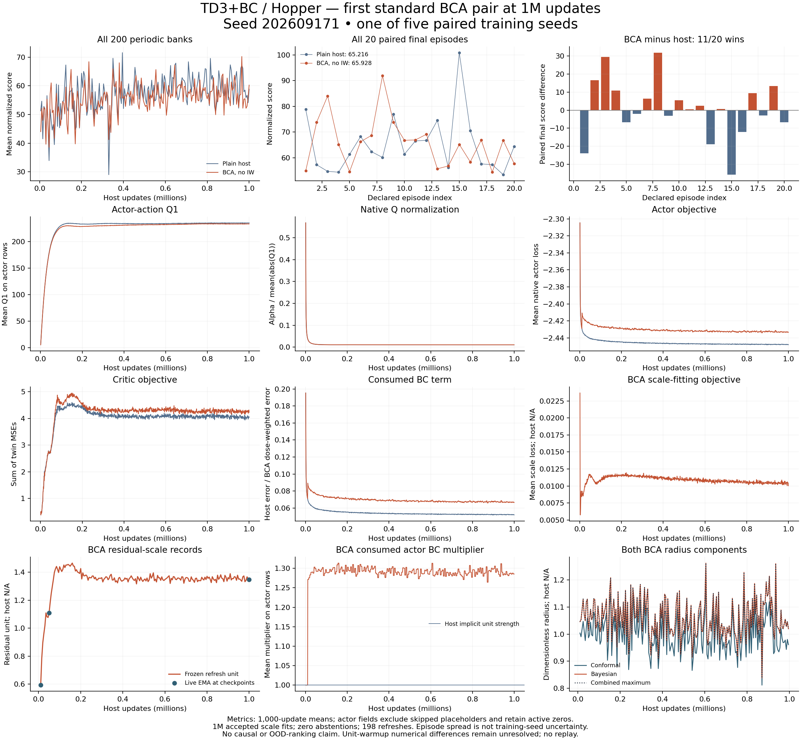

# TD3+BC / Hopper: first standard BCA pair at 1M

The no-IW BCA run `td3_bc-hopper-bca-noiw-s202609171` is independently verified
complete. Its final mean is **65.9275509**, versus **65.2157311** for the plain
host: **+0.7118198**. Its periodic-curve mean is **55.6709296**, versus
**57.1475157** for the host: **−1.4765860**. BCA wins 11 of 20 paired final
episodes, with no ties. Final return and curve summaries point in different
directions in this one training seed; four more declared pairs remain pending.

| Saved-return summary | Plain host | No-IW BCA |
|---|---:|---:|
| Final 20-episode mean | 65.2157311 | 65.9275509 |
| Mean of 200 ten-episode periodic banks | 57.1475157 | 55.6709296 |
| Same 1M checkpoint, periodic bank | 58.8301344 | 60.2320428 |
| Final episode median | 61.9065425 | 66.5381288 |
| Final episode sample SD | 11.2727909 | 9.8429400 |
| Final episode minimum | 53.4605838 | 54.4552481 |
| Final episode maximum | 100.8702052 | 91.9135590 |

Every original episode is retained. Matched reset seeds provide an episode-level
contrast, not twenty independent training seeds. Episode spread, medians and the
same-checkpoint periodic bank do not replace the final mean or supply training-seed
uncertainty. One paired seed does not establish a robust benefit, identified
cause or useful OOD ranking. Published scores and the earlier halted campaign
remain separate results and protocols.

## Verified execution and data

The actual BCA worker exited 0 at 2026-09-27T21:07:52.156101+00:00, without timeout
or interruption. The learner receipt agrees. Its existing local controller moved
to the declared CQL Hopper host row. The saved-result audit and figure renderer
each exited 0. No training or simulator execution was added by this audit.

All 108 frozen scientific source hashes, the manifest, resolved settings, cache
bytes, raw/converted arrays and reconstructed training/holdout/reference inputs
match. The paired host audit is reused without repulling its original training
files. Training/holdout IDs, normalization statistics and input hashes agree
between methods; all 201 evaluation banks have identical declared episode seeds
and score transforms. The three saved training RNG arrays also agree.

Both methods use 998,895 training rows and 1,103 reserved held-out rows; BCA has a
fixed 1,024-row training reference, while the host has none. Observation
normalization fits the training complement, with standard deviation plus 0.001;
Hopper rewards remain raw. Native alpha 2.5, batch 256, learning rate 0.0003,
discount 0.99, target rate 0.005, policy noise 0.2 clipped at 0.5, and actor delay
2 are unchanged.

All three 10k/50k/1M checkpoints match their hashes and decode to the expected
counters. There are **1M host/critic updates, 500k actor/target updates, 1M accepted
scale fits and zero abstentions**. Unused target optimizer counts stay zero.
The complete journal has 1,000 accepted scan blocks, 198 declared refreshes,
200 ten-episode periodic banks, twenty final episodes and a terminal completion
marker: 2,020 evaluation episodes in total. No failed event is present.

## Calibration and consumed strength

Importance fitting is off. Bayesian bootstrap fitting masses remain unchanged;
this is not uniform fitting without bootstrap randomness. The no-IW declaration
has no affinity bandwidth, tempering or ESS-floor settings. Pure-importance and
product ESS diagnostics are not logged in this arm and are not reconstructed as
empirical results. Unweighted held-out posterior support and ESS are 1,103 at
every refresh.

Posterior alpha 0.1, credibility 0.95, 128 draws, blend 0.5, calibration learning
rate 0.001, beta 20, width penalty 0.005 and residual-scale EMA 0.99 are retained.
Each radius equals the maximum of the Bayesian and conformal components, and
the Bayesian radius matches the declared 95% order statistic of the saved draws.
Refresh seeds/keys, reference/holdout identities and all three checkpoint
posterior hashes match the corresponding frozen refresh records.

The Bayesian radius exceeds the conformal floor in **198/198** refreshes.
Saved frozen-reference diagnostics report zero floor-induced dose changes in
198/198; the conformal component remains present. At the last 995k refresh,
the combined radius is max(**1.019587636**, **0.961083055**), with frozen residual
unit **1.354202986**. The live residual-scale EMA at 1M is **1.346897125**. These
are different recorded quantities.

| Checkpoint | Live residual-scale EMA | Frozen posterior residual unit |
|---|---:|---:|
| 10k | 0.592628658 | 0.592628658 |
| 50k | 1.109417558 | 1.109417558 |
| 1M | 1.346897125 | 1.354202986 |

BCA consumes unit strength for the first 10k host / 5k actor updates. Its last
10k mean multiplier is **1.286553682** on actor-update rows and **1.286569855**
over all host rows. The host's scale, radius and accepted/abstained fitting
statistics are N/A, with zero fitting/refresh operations by design. A successful
fit, higher strength or return difference does not establish good OOD ranking.

## Q and loss interpretation

Metric traces average 1,000 host updates. Actor fields select zero-based odd
rows (one-based even updates); skipped placeholders are excluded and real active
zeros retained. Critic and scale losses use all host rows. The recorded Q1 is at
proposed actor actions after the critic update and before the actor update.
Critic loss sums twin MSEs. Lambda is alpha / mean(abs(Q1)); alpha normalizes Q.
The host BC term averages squared action errors, while BCA's recorded BC term
includes its detached per-row multiplier. It is not an unweighted error measure.

| BCA last 10k host-update window | Mean |
|---|---:|
| Actor-action Q1, actor rows | 233.387226208 |
| Lambda, actor rows | 0.010714607 |
| Actor loss, actor rows | -2.433119303 |
| Consumed BC term, actor rows | 0.066878986 |
| Critic loss, all host rows | 4.262025170 |
| Scale-fitting loss, all host rows | 0.010416836 |

The saved host/BCA metric summaries already differ during the initial unit-strength
warmup. All ten warmup blocks differ in at least one shared metric; maximum
block-mean absolute differences include Q1 0.0243068 and critic loss 0.0055738.
The native and multiplied BC branches group reductions differently, but the
exact cause of the evolving numerical difference is not established. This
qualification remains unresolved without replay; no replay or score-based
replacement was performed. Both original trajectories remain intact.

## Evidence and limits

[Accepted BCA audit](verified-v1/audit.json), [paired comparison](verified-v1/comparison.json),
[all BCA episodes](verified-v1/evaluations.json), [metric blocks](verified-v1/metric_blocks.json),
[all refresh records](verified-v1/refreshes.json), [process receipt](verified-v1/process_exit.json),
[vector figure](verified-v1/paired_overview.svg), [readout checks](verified-v1/readout_checks.json),
and [actual validation exits](../../../../../../docs/validation/standard-first-td3-pair.json).
The separate comparison object is authoritative for the paired contrast;
the per-run summary objects contain no embedded comparison.

The CPU audit emitted a CUDA-plugin discovery warning with GPUs hidden, then
completed all checks and exited 0 under `JAX_PLATFORMS=cpu`. Its original stderr
is preserved. No scientific retry occurred. The initial schema inspection printed
excess checkpoint details into a private monitoring file; that file is excluded
from publication. Published evidence contains no checkpoint weights.

Real OOD collection remains pending its separate frozen protocol/action/random-
stream and simulator acceptance, including unchanged absolute action 1e-6 and
reward 1e-7 tolerances. Within-state and pooled AUC remain distinct. Any later IW
recipe must be selected from separately predeclared development evidence, not
these final outcomes.
