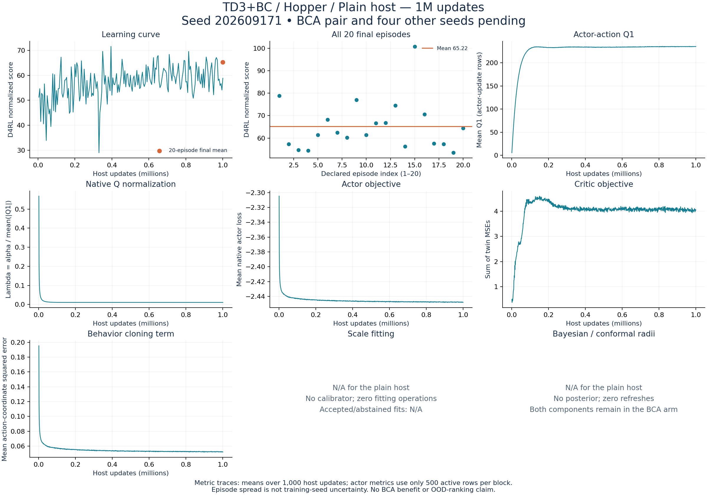

# TD3+BC / Hopper / Plain host: first standard-study 1M result

Run `td3_bc-hopper-host-s202609171` is independently verified complete. The final 20-episode mean is **65.2157311**, and the mean of all 200 periodic-bank means is **57.1475157**. The no-IW BCA counterpart was running at the monitoring snapshot. This is one training seed: there is no paired BCA result or training-seed uncertainty estimate yet.

| Saved-return summary | Value |
|---|---:|
| Final 20-episode mean | 65.2157311 |
| Mean of 200 ten-episode periodic banks | 57.1475157 |
| Same 1M checkpoint, periodic bank | 58.8301344 |
| Final episode median | 61.9065425 |
| Final episode sample SD | 11.2727909 |
| Final episode range | 53.4605838–100.8702052 |
| Completed training seeds | 1 of 5 |
| Paired BCA comparisons | 0 of 5 |

All 20 original final episodes are retained, including the high score 100.8702052. Episode spread and the periodic-versus-final bank difference are reset variation, not training-seed uncertainty. The periodic mean and median do not replace the final mean. This host result establishes neither a BCA benefit nor useful OOD ranking. Published scores and the old halted campaign remain separate protocols/results.

## Verified execution and provenance

The actual worker exited 0 at 2026-09-27T19:59:58.114488+00:00; the learner receipt also records success. The controller continues its declared queue and has no final exit yet. The audit independently checked the frozen manifest and all 108 source files, resolved scientific settings, actual cache bytes and raw/converted arrays. Reconstructed normalized training and holdout tuples match their saved hashes; the training fingerprint matches the accepted paired-data preflight.

There are 998,895 training rows, 1,103 held-out rows and no posterior reference rows. Observation normalization uses only training observations, with standard deviation plus 0.001. Hopper rewards remain raw. Native settings retain alpha 2.5, batch 256, learning rate 0.0003, discount 0.99, target rate 0.005, policy noise 0.2 clipped at 0.5, and actor delay 2.

All three saved 10k/50k/1M checkpoints match their recorded hashes. Decoded optimizer and target counters confirm 1M host/critic updates and 500k actor/target updates; unused target optimizer counts remain zero. The complete gzip journal has 1,000 accepted scan blocks, 200 periodic banks of ten episodes, one final bank of twenty, and its terminal completion marker. All 2,020 episode identities and score transformations agree with the declared banks and result. No failed event or posterior refresh occurs.

The host's calibrator, posterior and residual-scale fields are None. Fitting and refresh operations are zero by design; accepted/abstained fitting statistics, scale, width, ESS and Bayesian/conformal radii are **N/A**, not zero-valued BCA measurements. Both radius components remain required in the BCA counterpart.

## Metric interpretation

The plots show means over each 1,000 host updates. Actor metrics select one-based even updates (zero-based odd rows): skipped placeholders are excluded and real active zeros are kept. Critic loss uses every host row.

Q1 is measured at the proposed actor action after the critic update and before the actor update. Critic loss sums the twin mean-squared errors. Native BC loss averages squared errors over the three action coordinates. Lambda is alpha / mean(abs(Q1)); actor loss is -lambda * mean(Q1) + BC. Alpha normalizes the Q term.

| Last 10k host-update window | Mean |
|---|---:|
| Q1, active actor rows | 235.215876196 |
| Lambda, active actor rows | 0.010631305 |
| Actor loss, active actor rows | -2.447776580 |
| BC loss, active actor rows | 0.052221824 |
| Critic loss, all host rows | 4.047573684 |

These saved metrics do not identify a causal explanation or establish OOD-ranking quality. This audit added no learner update, model query or simulator step and used no GPU. Real OOD collection remains pending frozen action/stream and simulator checks with unchanged tolerances.

## Evidence and preserved audit attempts

[Accepted audit](verified-v4/audit.json), [all evaluation episodes](verified-v4/evaluations.json), [metric block summaries](verified-v4/metric_blocks.json), [process receipt](verified-v4/process_exit.json), [vector figure](verified-v4/overview.svg), and [actual audit exits](../../../../../../docs/validation/standard-first-td3-host.json).

Three failed read-only audit attempts are retained: the first required exact equality despite three frozen logging defaults omitted from the manifest; the second omitted the declared terminal completed event; the third compared bank dictionaries without accounting for the journal's method annotation. Corrections explicitly validate those writer contracts. The fourth audit passed with actual exit 0; original training bytes were unchanged and training was not retried. The initial process receipt is in this folder; `verified-v2` and `verified-v3` contain pending process receipts from unsuccessful audits, not accepted scientific verification.
