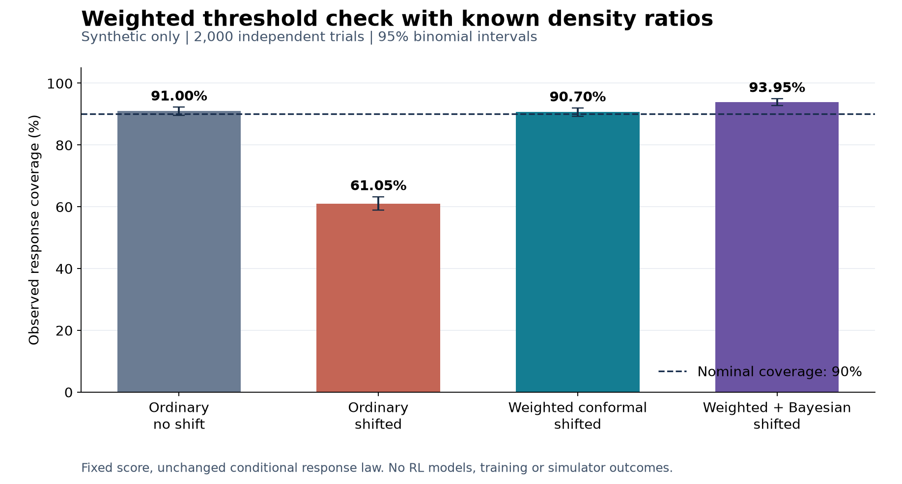

# Weighted conformal correction: mathematical validation

This is a controlled scalar experiment, not an RL or OOD-policy result. The intended IW method now has a separately tested weighted-threshold reference. Four-host training integration remains incomplete.

| Calculation | Coverage | 95% binomial interval | Mean finite radius |
|---|---:|---:|---:|
| Ordinary, source population | 91.00% | 89.66–92.22% | 2.999 |
| Ordinary, shifted population | 61.05% | 58.87–63.19% | 2.999 |
| Weighted conformal, shifted | 90.70% | 89.34–91.94% | 5.295 |
| Weighted + Bayesian maximum, shifted | 93.95% | 92.81–94.95% | 5.590 |

All four arms had zero infinite radii in these 2,000 trials. Separate boundary tests deliberately require infinity and verify that it is preserved. The Bayesian maximum is wider; its extra coverage is not evidence of better interval efficiency or a 95%-confidence population-risk guarantee.

## What this checks

The source contains 20% high-error examples; the target contains 80%. Conditional responses are unchanged: Uniform(0,1) for easy examples and Uniform(0,6) for hard examples. The frozen predictor is zero and scale is one. Exact target/source ratios are 0.25 and 4, used at BOTH calibration examples and the query. Each trial has 199 fresh calibration examples and independent source/target queries. Alpha stays 0.1. Both radius components remain available.

Ordinary conformal loses coverage under this constructed shift. The corrected weighted threshold recovers approximately the nominal coverage here. This tests the weighted threshold mechanism under its stated assumptions; it does not show that the old standard-BCA result was caused by this mismatch, nor that existing policy/affinity/AWR fitting weights are correct ratios.

## Verification and reproducibility

- 15 unit checks passed, including exact finite-population enumeration, finite-sample query mass, unequal weights, support refusal, ties, rescaling and interval arithmetic.
- An independent implementation reconstructed all 2,000 saved trials and all 8,000 reported radii, plus coverage counts, binomial intervals and source/input hashes.
- Protected-file comparisons passed for 683 supplied paths (0 when no external protection receipt was requested).
- No model loaded, learner update or simulator step. Actual exits are recorded separately.
- `manifest.json` binds the code and predeclared YAML before outcomes. `synthetic_panels.json.gz` retains the scalar inputs and outputs; `null` radius means positive infinity. Bootstrap draws reproduce from the pinned PCG64 streams.

The first synthetic attempt and both reader failures are preserved in `../2026-09-29/`. Floating subtraction originally represented the nominal easy ratio 0.25 as 0.24999999999999994. Independent checks exposed exact quantile-boundary differences. The corrected runner forms the ratios from the declared decimal probabilities using rational arithmetic, obtaining exactly 0.25 and 4. No coverage gate or scientific parameter changed. A separate comparison verifies identical generated calibration/query data and bootstrap seed conventions between attempts and reports any radius/coverage differences explicitly.

Run the independent reader and figure builder with NumPy, SciPy and matplotlib:

`python experiments/weighted_conformal/verify.py --output outputs/weighted_conformal/new-validation`

See [the corrected design](../../../docs/WEIGHTED_CONFORMAL_DESIGN.md) and [reproduction instructions](../../../experiments/weighted_conformal/README.md). Remaining real-data gates are the target population and valid ratio/support, independent calibration sampling, query-specific host bindings, infinity behavior, and the frozen training comparison.

## Numerical correction and repository check

The corrected ratio changes 122 of 2,000 weighted conformal radii and changes its coverage count by -1 (1815 to 1814); weighted-plus-Bayesian radii and coverage stay unchanged. Every calibration/query input and all seed conventions are identical. Original attempts remain archived.

The new unit tests and independent verifier exit 0. The broader existing `check.py` exits 1 at a pre-existing `.gitattributes` hash mismatch in `configs/sources.json`; all mismatching files match their pre-task hashes. That older provenance record was not rewritten or bypassed. See `execution_receipt.json` for the complete list.
